# 13. 아키텍처 다이어그램

- **이 문서는 무엇을 설명하나요?** Architecture v5 전체 흐름과 역할·데이터 관계를 그림으로 보여 줍니다.
- **누가 읽어야 하나요?** 전체 흐름을 빠르게 파악하려는 모든 팀원이 읽습니다.
- **읽은 뒤 무엇을 확인하거나 결정하나요?** 번호 문서의 단계와 화살표가 같은 의미인지, 빠진 흐름이 없는지 확인합니다.

정확한 Mermaid 이름은 번호 문서의 데이터·상태 이름과 맞추기 위해 유지합니다. 모르는 이름은 [쉬운 용어집](../GLOSSARY.md)에서 확인하세요.

## 다이어그램 읽는 법

- 사각형은 실행 단계나 결과를 나타냅니다.
- 마름모는 조건에 따라 다음 흐름이 달라지는 판단 지점을 나타냅니다.
- 원통 모양은 데이터 저장소를 나타냅니다.
- 실선 화살표는 다음 호출·처리 순서를 나타냅니다.
- 점선 화살표는 검토·보완·새 가설처럼 기본 흐름으로 되돌아가는 관계를 나타냅니다.
- `TRUE / FALSE / HOLD` 같은 영문 상태값은 구현에서 정확히 맞춰야 하므로 그림에서 그대로 사용합니다.

> 상태: **DESIGN_AUTHORED / REVIEW_REQUIRED / NOT_IMPLEMENTED**

## 1. 정본 23단계 파이프라인

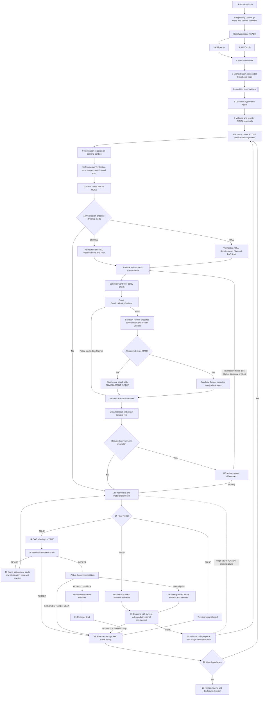

가설들은 예산 범위에서 병렬화할 수 있지만, 한 가설 안의 `workspace_id`·`commit_id`·판정·Gate 순서와 Reporter 전제는 유지한다.

## 2. 정적 사실과 위치 기반 조회

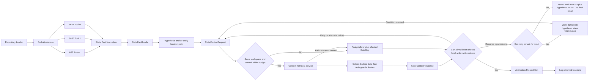

empty, truncated, gap와 error는 `TRUE | FALSE | HOLD`의 근거로 자동 변환하지 않는다. 일부 조회 실패가 있어도 정상 근거로 모든 검증 항목을 완료하면 판정할 수 있다. 필수 입력이 없지만 다시 시도할 수 있으면 work만 `BLOCKED`로 두고 가설은 `VERIFYING`을 유지한다. 더 시도할 수 없으면 work와 가설을 함께 `FAILED`로 끝내고 final `VerificationResult`를 만들지 않는다.

## 3. 저비용 가설 생성과 출력 통제

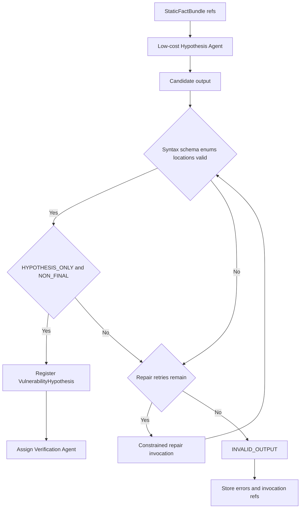

proposal은 facts와 assumptions, restrictions, missing information, falsification questions, 고유 `validation_id`가 있는 `validation_checks`를 분리한다. confidence는 우선순위 힌트일 뿐 verdict가 아니다.

## 4. 운영 상시 찬반 검증과 평가 모드

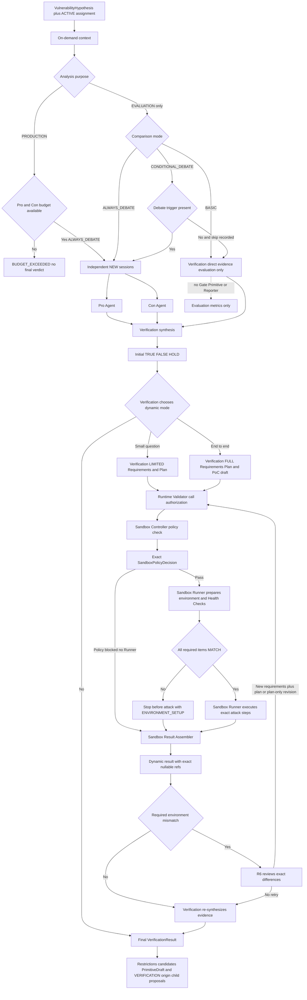

별도 endpoint·sink·권한 경계·impact 주장은 같은 verdict에 합치지 않고 새 가설로 보낸다.

## 5. Primitive DB와 Chaining admission

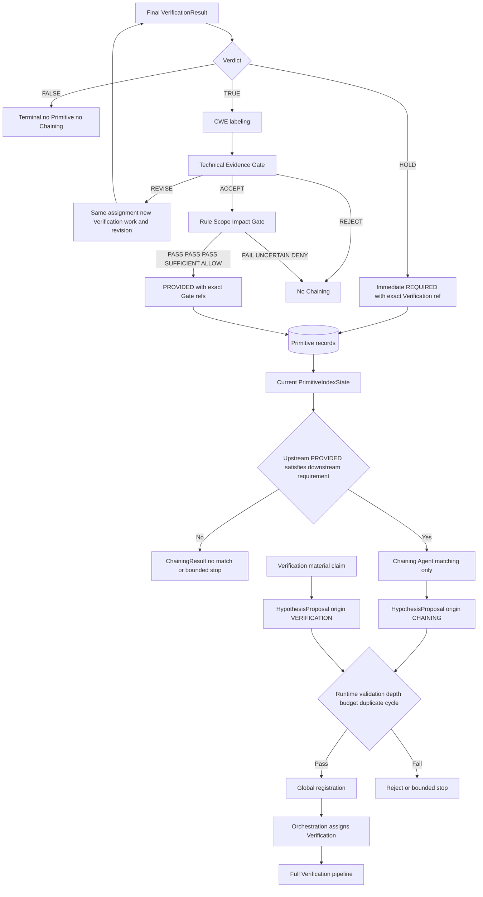

Primitive DB는 queue가 아니며 Chaining match와 child proposal은 Finding이 아니다. Gate 전 TRUE와 오래된 Gate revision은 ACTIVE PROVIDED가 될 수 없다.

## 6. 이중 LLM Gate와 사람 결정

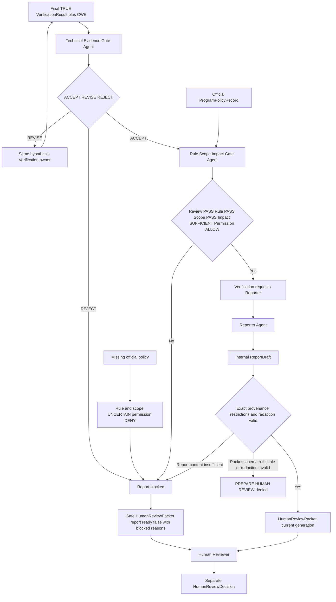

두 Gate 모두 LLM 검토 Agent이고 Verification verdict를 직접 바꾸지 않는다. 공식 정책이 없으면 Reporter 경로는 닫힌다. `ALLOW`와 `report_ready`는 사람 결정이 아니며, current packet의 `DISCLOSE` 결정도 외부 action 자체가 아니다.
두 Gate 모두 LLM 검토 Agent이고 Verification verdict를 직접 바꾸지 않는다. Technical Gate는 exact final `TRUE`만 검토하며 `FALSE | HOLD`와 실패 가설은 입력으로 받지 않는다. 공식 정책이 없으면 Reporter 경로는 닫힌다.

## 7. Provider, session과 logging

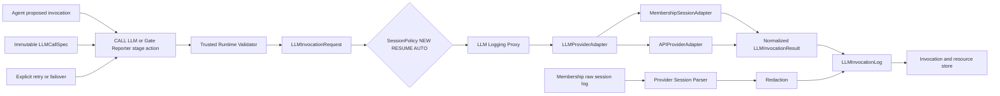

provider/model과 실제 session 결정은 기록한다. trusted runtime이 허용 profile·budget·session policy를 검증하며 silent failover, credential logging과 hidden chain-of-thought 수집은 허용하지 않는다.

## 8. 결과·자원·디버깅 저장

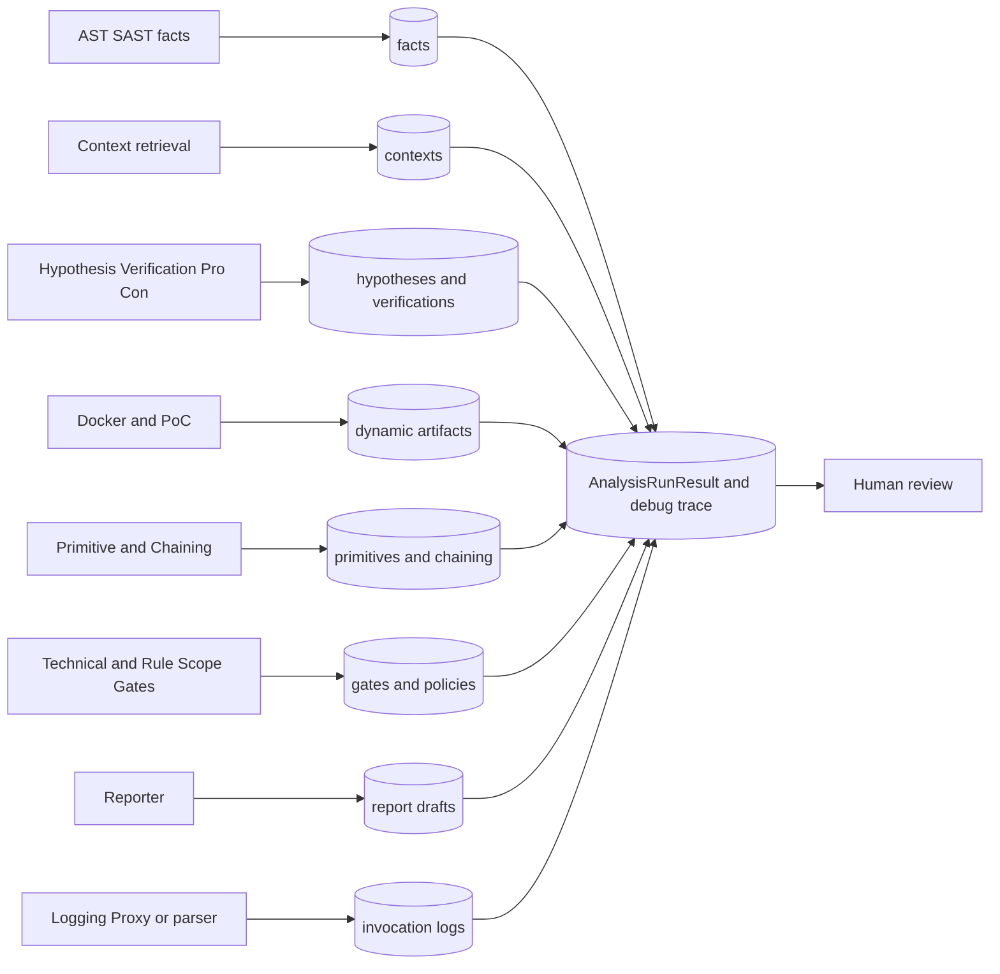

## 9. 공통 식별자와 revision 추적

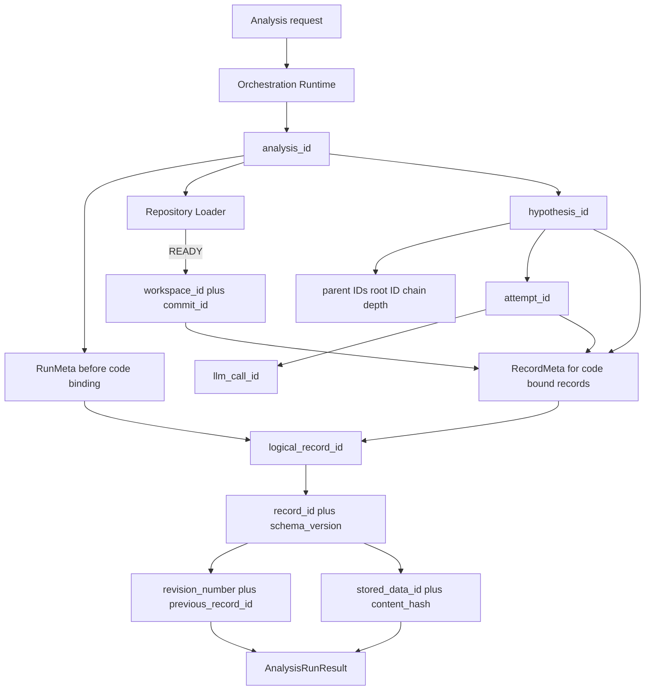

clone 전 실행 기록은 `RunMeta`, 준비된 코드 근거는 `RecordMeta`를 사용한다. 시스템이 생성한 ID는 다른 대상에 재사용하지 않는다. 외부 Git ID인 `commit_id`는 같은 commit을 여러 분석에서 참조할 수 있다. 새 revision은 `logical_record_id`를 유지하고 새 `record_id`로 연결하며, chain 가설은 새 `hypothesis_id`를 사용한다.

## 10. 공통 실행 상태

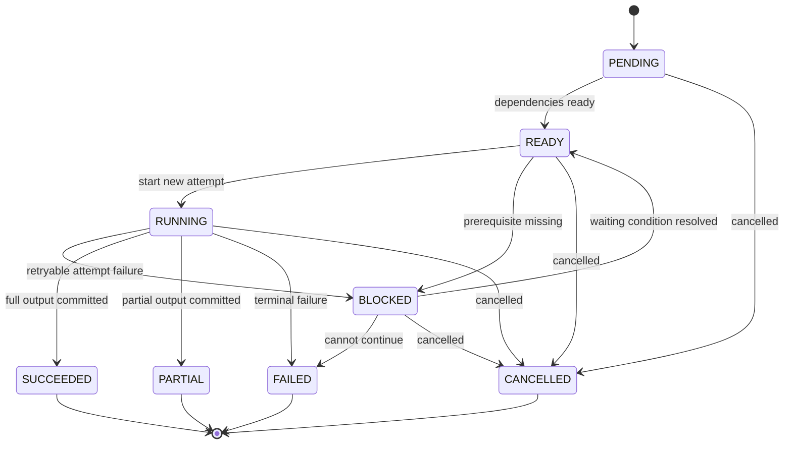

작업 상태는 전문 판정과 분리한다. retry 가능한 attempt 실패는 work를 `BLOCKED`로 두고, 조건을 해결한 뒤 새 `attempt_id`로 다시 시작한다. `SUCCEEDED | PARTIAL | FAILED | CANCELLED`는 되돌리지 않는다.

## 11. 중복 방지와 atomic 저장·복구

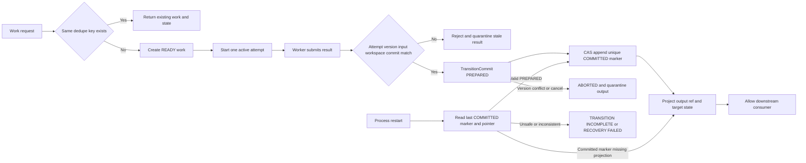

다음 단계는 `COMMITTED` marker와 상태 pointer가 같은 output을 가리킬 때만 읽는다. Verification `TERMINAL`, 두 Gate 완료와 Report `DRAFTED`는 각각 정확한 결과 `record_id`에 atomic하게 연결되어야 한다.

## 12. LLM 제안과 프로그램 실행 권한

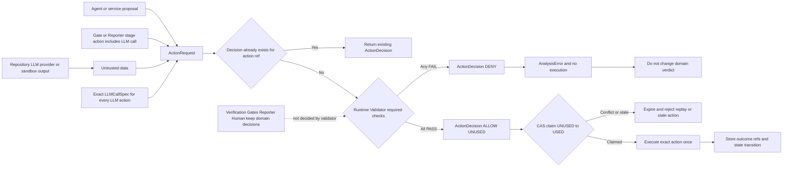

Runtime Validator는 schema·권한·ID·revision·상태·예산·일반 도구·경로·provider·Gate 순서·Reporter·redaction·공개 전제를 검사한다. `RUN_SANDBOX`에서는 호출 권한·상태·예산·exact plan reference까지만 확인하고, image·command·file·network·resource·cleanup 정책은 Sandbox Controller가 검사한다. 취약점 진위, CWE, 정책 의미와 보고서 내용은 판단하지 않는다.

## 13. 사람 검토와 외부 공개 경계

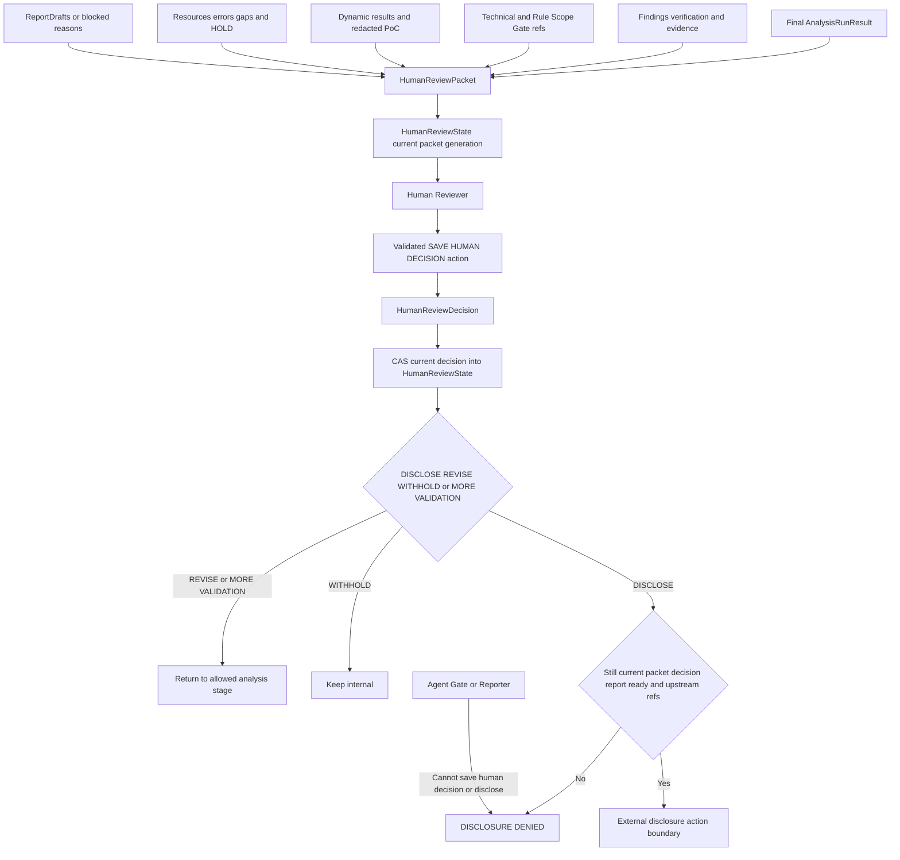

사람 결정은 ReportDraft와 분리한다. 새 packet generation은 이전 결정을 supersede한다. 실제 자동 제출 integration은 이 설계에 포함하지 않으며, 향후 추가해도 current `DISCLOSE` 결정과 redaction 검사를 건너뛸 수 없다.

## Rendering check

이 문서는 Mermaid 블록 13개를 포함한다. Wiki diagrams 페이지는 이 파일과 동일한 Mermaid 블록을 사용하며 최종 검증에서 13개 SVG와 parse error 0개를 확인한다.
