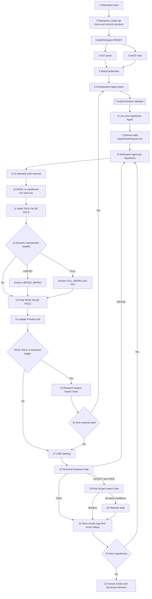
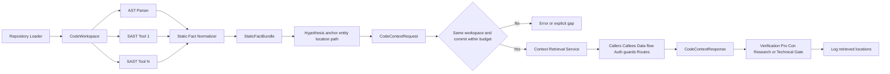
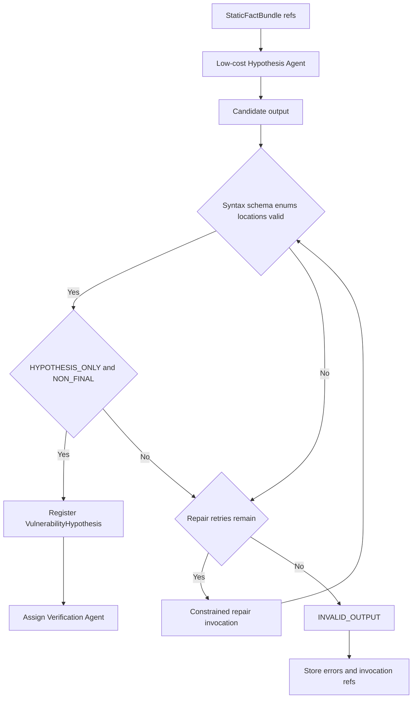
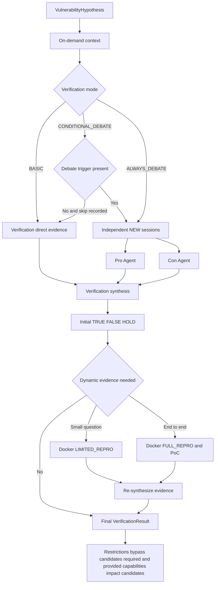
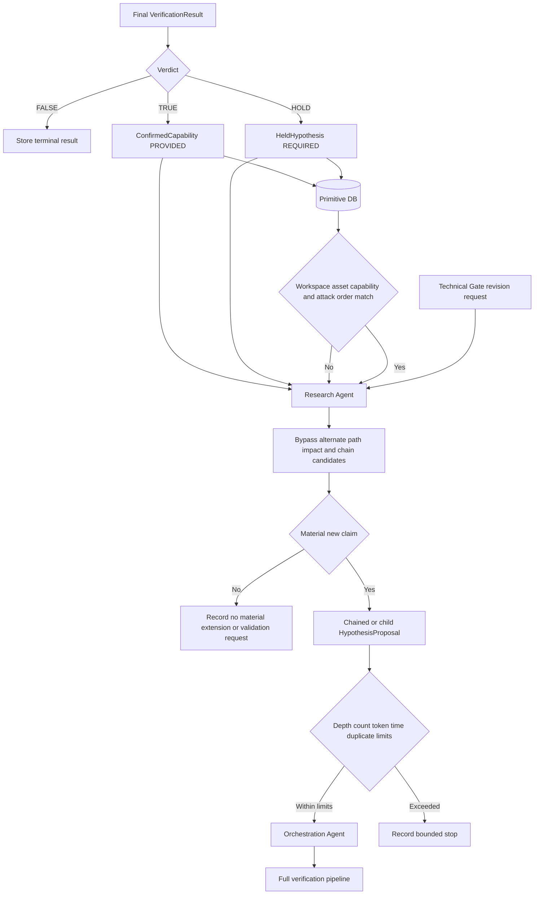
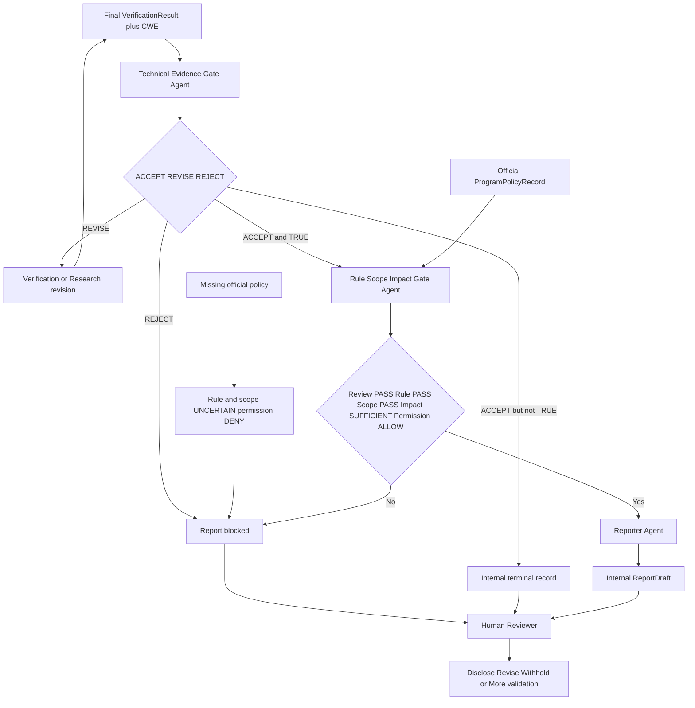
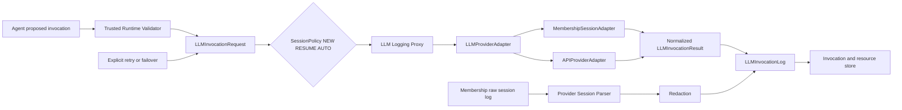

# 13. 아키텍처 다이어그램

- **이 문서는 무엇을 설명하나요?** Architecture v5 전체 흐름과 역할·데이터 관계를 그림으로 보여 줍니다.
- **누가 읽어야 하나요?** 전체 흐름을 빠르게 파악하려는 모든 팀원이 읽습니다.
- **읽은 뒤 무엇을 확인하거나 결정하나요?** 번호 문서의 단계와 화살표가 같은 의미인지, 빠진 흐름이 없는지 확인합니다.

정확한 Mermaid 이름은 번호 문서의 데이터·상태 이름과 맞추기 위해 유지합니다. 모르는 이름은 [쉬운 용어집](../GLOSSARY.md)에서 확인하세요.

## 다이어그램 읽는 법

- 사각형은 실행 단계나 결과를 나타냅니다.
- 마름모는 조건에 따라 다음 흐름이 달라지는 판단 지점을 나타냅니다.
- 원통 모양은 데이터 저장소를 나타냅니다.
- 실선 화살표는 다음 호출·처리 순서를 나타냅니다.
- 점선 화살표는 검토·보완·새 가설처럼 기본 흐름으로 되돌아가는 관계를 나타냅니다.
- `TRUE / FALSE / HOLD` 같은 영문 상태값은 구현에서 정확히 맞춰야 하므로 그림에서 그대로 사용합니다.

> 상태: **DESIGN_AUTHORED / REVIEW_REQUIRED / NOT_IMPLEMENTED**

## 1. 정본 23단계 파이프라인

가설들은 예산 범위에서 병렬화할 수 있지만, 한 가설 안의 `workspace_id`·`commit_id`·판정·Gate 순서와 Reporter 전제는 유지한다.

## 2. 정적 사실과 위치 기반 조회

empty, truncated와 unresolved response는 안전함 또는 `FALSE`로 자동 변환하지 않는다.

## 3. 저비용 가설 생성과 출력 통제

proposal은 facts와 assumptions, restrictions, missing information, falsification questions와 required validation을 분리한다. confidence는 우선순위 힌트일 뿐 verdict가 아니다.

## 4. 조건부 검증과 Docker 재현

별도 endpoint·sink·권한 경계·impact 주장은 같은 verdict에 합치지 않고 새 가설로 보낸다.

## 5. Primitive DB와 Research loop

Primitive DB는 queue가 아니며 Research·match 결과는 Finding이 아니다.

## 6. 이중 LLM Gate와 사람 결정

두 Gate 모두 LLM 검토 Agent이고 Verification verdict를 직접 바꾸지 않는다. 공식 정책이 없으면 Reporter 경로는 닫힌다.

## 7. Provider, session과 logging

provider/model과 실제 session 결정은 기록한다. trusted runtime이 허용 profile·budget·session policy를 검증하며 silent failover, credential logging과 hidden chain-of-thought 수집은 허용하지 않는다.

## 8. 결과·자원·디버깅 저장

## Rendering check

이 문서는 Mermaid 블록 8개를 포함한다. Wiki diagrams 페이지는 이 파일과 동일한 Mermaid 블록을 사용하며 최종 검증에서 8개 SVG와 parse error 0개를 확인한다.
