# 13. 아키텍처 다이어그램

## 쉽게 말하면

Architecture v5의 전체 처리 순서와 역할·데이터 관계를 그림으로 보여 줍니다. Mermaid 안의 영문 이름은 기준 문서와 정확히 맞추기 위해 유지합니다.

**상세 기준:** [13. 아키텍처 다이어그램](../13-architecture-diagrams.md)

모르는 이름은 [쉬운 용어집](../../GLOSSARY.md)에서 확인하세요.

> 상태: **DESIGN_AUTHORED / REVIEW_REQUIRED / NOT_IMPLEMENTED**

## 1. 정본 22단계 파이프라인

```mermaid
flowchart TB
    S01[1 Repository input] --> S02[2 Repository Loader git clone and commit checkout]
    S02 --> WORK[CodeWorkspace READY]
    WORK --> S03A[3 AST parse]
    WORK --> S03B[3 SAST tools]
    S03A --> S04[4 StaticFactBundle]
    S03B --> S04
    S04 --> S05[5 Orchestration starts initial hypothesis work]
    S05 --> RUNTIME[[Trusted Runtime Validator]]
    RUNTIME --> S06[6 Low-cost Hypothesis Agent]
    S06 --> S07[7 Validate deduplicate and register INITIAL proposals]
    S07 --> S08[8 Runtime stores ACTIVE VerificationAssignment]
    S08 --> S09[9 Verification requests on-demand context]
    S09 --> S10[10 Production Verification runs independent Pro and Con]
    S10 --> S11[11 Initial TRUE FALSE HOLD]
    S11 --> S12{12 Dynamic work required}
    S12 -->|Complete static and debate FALSE or HOLD| S13[13 Final verdict and material claim split]
    S12 -->|Initial TRUE| DREQ[Verification requests POC_CONFIRMATION]
    S12 -->|Execution evidence needed| DREQ2[Verification requests VERDICT_EVIDENCE]
    DREQ --> DWAUTH[Runtime allows one dynamic work per generation]
    DREQ2 --> DWAUTH
    DWAUTH --> DR7[R7 Agent creates Requirements and simple Plan]
    DR7 --> DAUTH[Runtime authorizes external Sandbox boundary]
    DAUTH --> DCTRL[Controller checks host Docker secret egress resource boundaries]
    DCTRL --> DPD[Exact SandboxPolicyDecision]
    DPD -->|Pass| DENV[Setup Automation builds recipe and prepares clean environment]
    DPD -->|Policy blocked| DSTOP[Attempt cannot complete no verdict]
    DENV --> DRUN[R7 Agent autonomously creates and runs PoC in Sandbox]
    DRUN --> DLOG[Session Manager appends actual events to AgentLog]
    DLOG --> DASM[Session Manager binds same-attempt recipe environment candidate and evidence]
    DASM --> DRES[Dynamic result and validated PoC only on supported success]
    DRES --> DOUT{Observed outcome}
    DOUT -->|SUPPORTED| POCOK{Validated PoC and supported result}
    POCOK -->|Yes| S13
    POCOK -->|No| DSTOP
    DOUT -->|DISPROVED or INCONCLUSIVE| S13
    DOUT -->|Execution failure| DSTOP
    DSTOP -->|Autonomous retry same work new attempt| DR7
    DSTOP -->|External condition| DWAIT[BLOCKED until input policy or resource change]
    DWAIT --> DR7
    DSTOP -->|Unrecoverable| S22
    S13 --> S14{14 Final verdict}
    S14 -->|FALSE| CLOSED[Terminal internal result]
    S14 -->|HOLD| HREQ{Required candidates exist}    HREQ -->|Yes| REQUIRED[Result null Primitive with required inputs admitted]    HREQ -->|No| HEND[HOLD no Primitive no Chaining]
    S14 -->|TRUE with validated PoC| CWE[14 R5-01 CWE_LABELING creates current CWELabel bound to exact Verification]
    CWE --> S15[15 Technical Evidence Gate]
    S15 -->|REVISE| S16[16 Same assignment starts new Verification work and revision]
    S16 --> S09
    S15 -->|REJECT| S22[22 Store results logs PoC errors debug]
    S15 -->|ACCEPT| S17[17 Policy collection and Rule Scope review]
    S17 --> ADEC{PrimitiveAdmissionDecision}
    ADEC -->|ALLOW| PADMIT[Result Primitive admitted]
    ADEC -->|DENY confirmed prohibited test| S22
    S17 --> S19[19 Apply remaining report conditions]
    S19 -->|FAIL UNCERTAIN or DENY| S22
    REQUIRED --> S18[18 Chaining upstream result to downstream input]
    PADMIT --> S18
    S19 -->|All report conditions| RREQ[Verification requests Reporter]
    RREQ --> S21[21 Reporter draft]
    S18 -->|Match| S20[20 Validate child proposal and assign new Verification]
    S18 -->|No match or global budget stop| S22
    S20 --> S08
    S13 -. origin VERIFICATION material claim .-> S20
    S21 --> S22
    CLOSED --> S22
    S22 --> MORE{22 More hypotheses}
    MORE -->|Yes| S08
    MORE -->|No| END[22 Finalize AnalysisRunResult and end Agent automation]
```

가설들은 예산 범위에서 병렬화할 수 있지만, 한 가설 안의 `workspace_id`·`commit_id`·판정·Gate 순서와 Reporter 전제는 유지한다.

## 2. 정적 사실과 위치 기반 조회

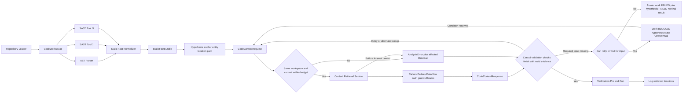

empty, truncated, gap와 error는 `TRUE | FALSE | HOLD`의 근거로 자동 변환하지 않는다. 일부 조회 실패가 있어도 정상 근거로 모든 검증 항목을 완료하면 판정할 수 있다. 필수 입력이 없지만 다시 시도할 수 있으면 work만 `BLOCKED`로 두고 가설은 `VERIFYING`을 유지한다. 더 시도할 수 없으면 work와 가설을 함께 `FAILED`로 끝내고 final `VerificationResult`를 만들지 않는다.

## 3. 저비용 가설 생성과 출력 통제

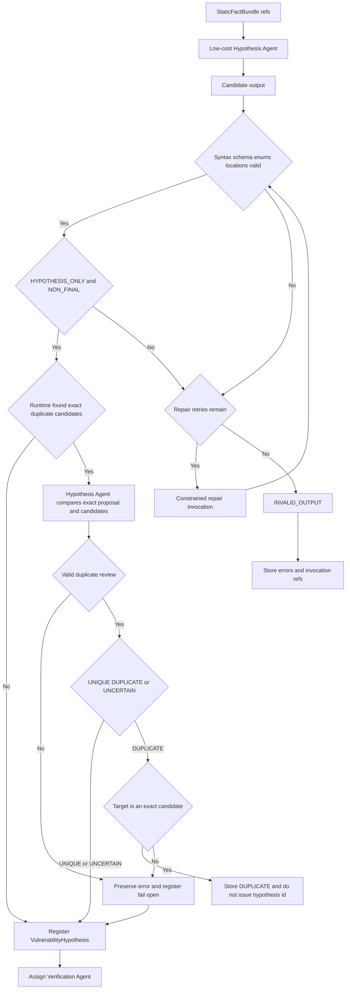

proposal은 observed facts, exact 근거가 연결된 restrictions, assumptions, falsification questions, 고유 `validation_id`가 있는 `validation_checks`를 분리한다. 같은 코드 사실은 observed fact와 restriction 근거 양쪽에 중복하지 않는다. 중복 비교 후보는 같은 analysis·workspace·commit에서 runtime이 좁히며, 후보 밖 중복 대상·호출 실패·형식 오류는 기록을 남기고 fail-open 등록한다. 등록된 가설은 전수 검증하며 점수로 선별하거나 순서를 매기지 않는다.

## 4. 운영 상시 찬반 검증과 평가 모드

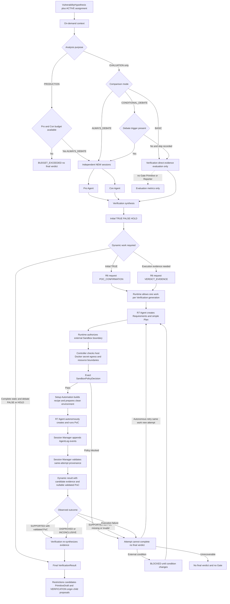

별도 endpoint·sink·권한 경계·impact 주장은 같은 verdict에 합치지 않고 새 가설로 보낸다.

## 5. Primitive DB와 Chaining admission

```mermaid
flowchart TB
    VR[Final VerificationResult] --> KIND{Verdict}
    KIND -->|FALSE| CLOSED[Terminal no Primitive no Chaining]
    KIND -->|HOLD| HREQ{Required candidates exist}    HREQ -->|Yes| REQUIRED[Primitive with inputs and null result]    HREQ -->|No| HEND[HOLD no Primitive no Chaining]
    KIND -->|TRUE with current validated PoC| CWE[R5-01 CWE_LABELING creates exact current CWELabel]
    CWE --> TECH[Technical Evidence Gate]
    TECH -->|REVISE| SAME[Same assignment new Verification work and revision]
    SAME --> VR
    TECH -->|REJECT| NOCHAIN[No Chaining]
    TECH -->|ACCEPT| COLLECT[PolicyCollectionResult]
    COLLECT -->|FOUND or ABSENT_CONFIRMED| RULE[Rule Scope Impact Gate]
    COLLECT -->|COLLECTION_FAILED| ADMIT[Primitive Admission Runtime]
    RULE --> ADMIT
    ADMIT -->|testing restriction PASS UNCERTAIN or NOT_EVALUATED| PROVIDED[Primitive with inputs and one result]
    ADMIT -->|testing restriction FAIL| NOCHAIN
    RULE -->|Other FAIL UNCERTAIN DENY| REPORTBLOCK[Report blocked but allowed Primitive remains usable]
    RULE -->|PASS PASS PASS SUFFICIENT ALLOW| REPORTOK[Reporter eligibility may continue]
    REQUIRED --> PDB[(Primitive records)]
    PROVIDED --> PDB
    PDB --> MATCH{Upstream result satisfies downstream input}
    MATCH -->|No| RECORD[ChainingResult with no material candidate]
    MATCH -->|Yes| CHAIN[Chaining Agent matching only]
    CHAIN --> NEW[HypothesisProposal origin CHAINING]
    NEW --> LIMIT{Runtime validation ancestor reuse across lineage, duplicate fingerprint, and global budget}
    LIMIT -->|Pass| REGISTER[Global registration]
    LIMIT -->|Fail| STOP[Reject or global budget stop]
    REGISTER --> ORCH[Orchestration assigns Verification]
    ORCH --> VERIFY[Full Verification pipeline]
    VMAT[Verification material claim] --> VNEW[HypothesisProposal origin VERIFICATION]
    VNEW --> LIMIT
```

Primitive DB는 queue가 아니며 Chaining match와 child proposal은 Finding이 아니다. Gate 전 TRUE, 오래된 Technical review revision과 current `PrimitiveAdmissionDecision=ALLOW`가 없는 TRUE는 result가 있는 Primitive가 될 수 없다. 금지 테스트 위반이 `FAIL`로 확정되면 admission을 거절한다. 그 밖의 Rule Scope 실패·불확실성과 보고 거절은 Reporter만 막고 `ALLOW`인 Primitive와 Chaining 자격은 유지한다.

## 6. 이중 LLM Gate와 Agent 자동화 종료

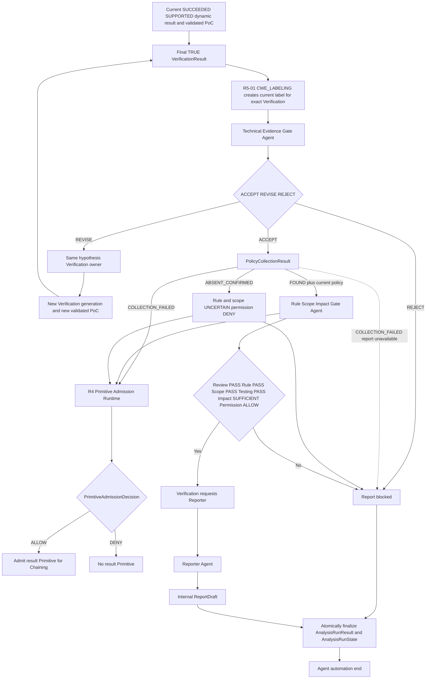

두 Gate 모두 LLM 검토 Agent이고 Verification verdict를 직접 바꾸지 않는다. Technical Gate는 current generation의 `SUCCEEDED + SUPPORTED` 결과와 validated PoC를 가진 exact final `TRUE`만 검토하며 `FALSE | HOLD`와 실패 가설은 입력으로 받지 않는다. 공식 정책이 없으면 Reporter 경로는 닫힌다.

## 7. Provider, session과 logging

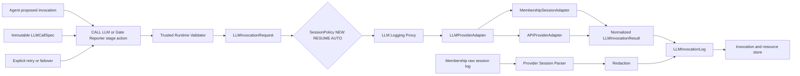

provider/model과 실제 session 결정은 기록한다. trusted runtime이 허용 profile·budget·session policy를 검증하며 silent failover, credential logging과 hidden chain-of-thought 수집은 허용하지 않는다.

## 8. 결과·자원·디버깅 저장

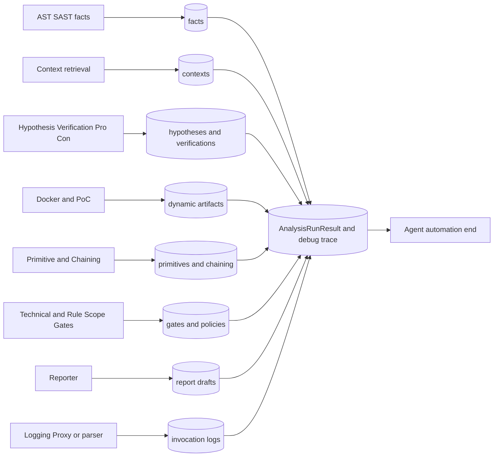

## 9. 공통 식별자와 revision 추적

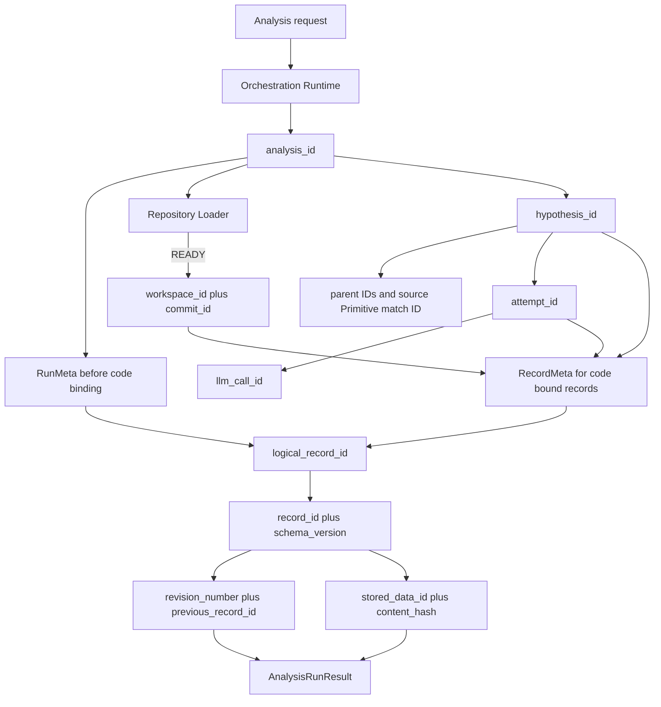

clone 전 실행 기록은 `RunMeta`, 준비된 코드 근거는 `RecordMeta`를 사용한다. 시스템이 생성한 ID는 다른 대상에 재사용하지 않는다. 외부 Git ID인 `commit_id`는 같은 commit을 여러 분석에서 참조할 수 있다. 새 revision은 `logical_record_id`를 유지하고 새 `record_id`로 연결하며, chain 가설은 새 `hypothesis_id`를 사용한다.

## 10. 공통 실행 상태

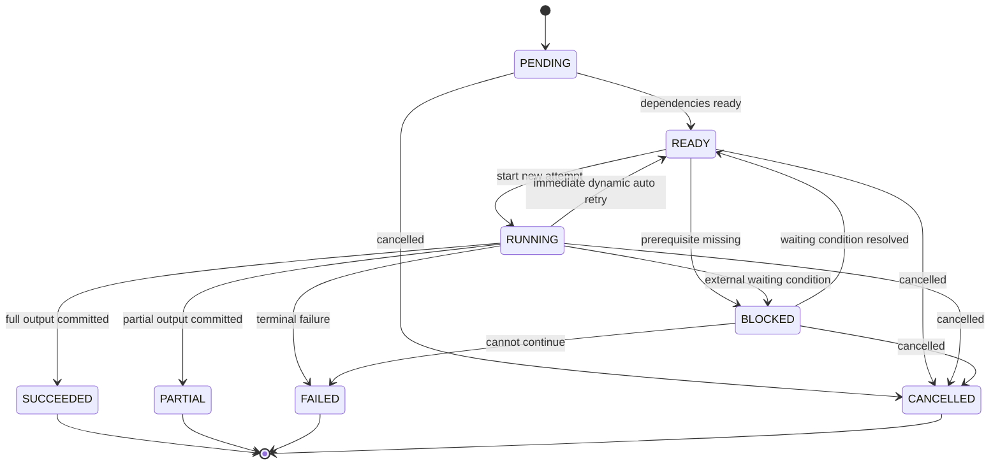

작업 상태는 전문 판정과 분리한다. 일반 retry가 외부 조건을 기다리면 work를 `BLOCKED`로 두고, 조건을 해결한 뒤 새 `attempt_id`로 다시 시작한다. `DYNAMIC_REPRO`가 외부 대기 없이 자체 해결할 수 있으면 `RUNNING -> READY -> RUNNING`으로 즉시 새 attempt를 시작한다. `SUCCEEDED | PARTIAL | FAILED | CANCELLED`는 되돌리지 않는다.

## 11. 중복 방지와 atomic 저장·복구

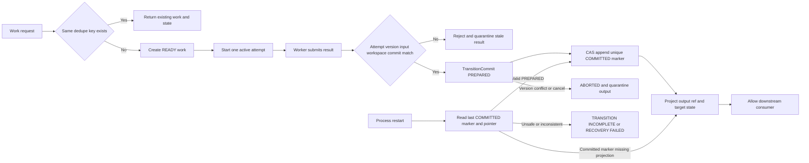

다음 단계는 `COMMITTED` marker와 상태 pointer가 같은 output을 가리킬 때만 읽는다. Verification `TERMINAL`, 두 Gate 완료와 Report `DRAFTED`는 각각 정확한 결과 `record_id`에 atomic하게 연결되어야 한다.

## 12. LLM 제안과 프로그램 실행 권한

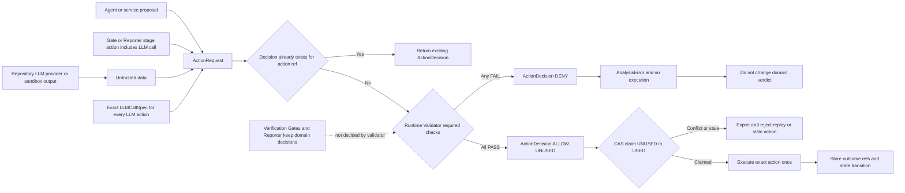

Runtime Validator는 schema·권한·ID·revision·상태·예산·일반 도구·경로·provider·Gate 순서·Reporter와 redaction 전제를 검사한다. `REQUEST_DYNAMIC_REPRO`에서는 current generation과 한 work 제한을, `RUN_SANDBOX`에서는 R7 Setup Automation 권한·상태·예산·exact request/requirements·R8 resource/lifecycle을 확인한다. host·Docker daemon/socket·mount/namespace·secret·egress·workspace 외부 경계는 Sandbox Controller가 검사하고 내부 command는 Agent가 자율적으로 정한다. 취약점 진위, CWE, 정책 의미와 보고서 내용은 판단하지 않는다.

## 13. ReportDraft와 Agent 자동화 종료 경계

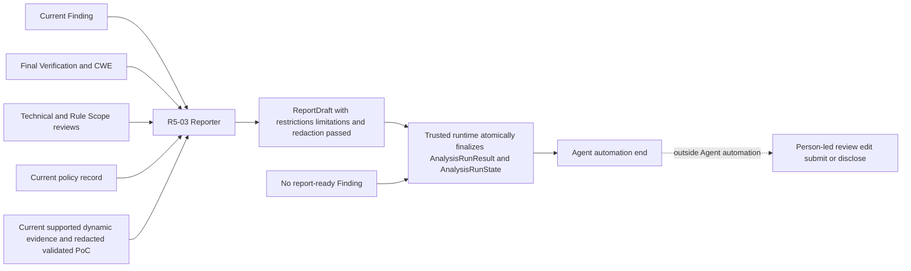

ReportDraft는 마지막 Agent 산출물이다. `AnalysisRunResult`와 `AnalysisRunState`의 원자적 확정은 기존 결과와 로그를 묶는 신뢰 runtime 작업이며 새 LLM 판단이 아니다. 점선 뒤의 사람 검토·수정·제출·공개는 Agent action과 상태 계약 밖이다.

## Rendering check

이 문서는 Mermaid 블록 13개를 포함한다. Wiki diagrams 페이지는 이 파일과 동일한 Mermaid 블록을 사용하며 최종 검증에서 13개 SVG와 parse error 0개를 확인한다.
