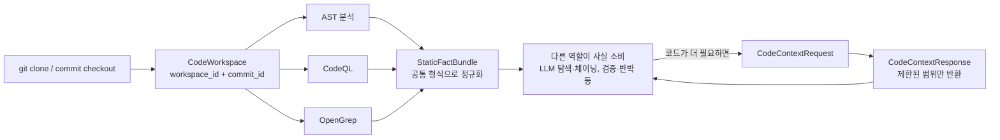

# R2(정적분석·컨텍스트) — 역할 설명 및 완료 조건 근거 정리

Issue #3(R2: 정적분석·컨텍스트)의 역할 설명과, 하위 Issue #32~35(R2-01~04)의 완료 조건 7개가
실제 설계 문서상의 근거로 뒷받침되는지 확인한 기록입니다.

> **2026-08-31 갱신**: 최초 작성 이후 `main`에 병합된 문서 재구성으로 어긋난 line 번호를
> `main` `8190b5f` 기준으로 재검증·갱신했습니다. 결론은 바뀌지 않았습니다.

> **2026-09-02 갱신 (PR #54의 R6·R7·R4 교차 리뷰 반영)**: R6·R4가 각각 다른 시점의 `main`
> (`beabdedf4cc5014cd77b88c687d4017603f3a566`, `eb0076602736ea3821b95c0b81d9a77ba10695d2`)을
> 기준으로 line drift를 지적했는데, 그 사이 `main`이 계속 이동해 두 커밋 모두 이미 지난 시점의
> `main`이었습니다. 그래서 이번에는 재확인 시점의 실제 `main` HEAD인
> `7e5450ac552877f54ddfcc613c06c734405e78bb`(짧게 `7e5450a`)를 기준으로 08/07/10/13번
> 문서를 다시 열어 모든 인용 line을 재검증·갱신했습니다. 내용상 결론은 바뀌지 않았습니다.
> R7·R4가 요청한 `StoredDataRef` 근거를 `#32` 섹션에 추가했고(아래), R4가 요청한 R5
> (`05-llm-gate-and-reporting.md`) 반영용 후속 Issue는 5번 섹션에 정리했습니다.

## 1. 이 Issue(#3)가 어떤 역할인가

**한 줄로**: AST(CodeQL, OpenGrep 등) 분석 결과를 LLM이 바로 쓸 수 있게, "어느 파일·함수·줄에서
무슨 사실이 나왔는지" 중심으로 정리하고, 필요할 때만 안전하게 코드를 더 가져다주는 역할.

**전체 파이프라인에서 위치**

이 구조는 저장소 공식 다이어그램·Wiki와 실제로 일치함을 확인했습니다.

- `docs/architecture-v5/13-architecture-diagrams.md` "## 2. 정적 사실과 위치 기반 조회"(L87-118,
  2026-09-02 `main` `7e5450a` 기준. 이전에는 L76-98이었으나 그 사이 문서가 재구성되며 이동함) —
  `Repository Loader → CodeWorkspace → AST/SAST → Static Fact Normalizer → StaticFactBundle →
  CodeContextRequest → (workspace/commit·budget 확인) → CodeContextResponse` 순서로 위 다이어그램과
  동일한 흐름을 정의하며, 바로 아래 줄(L118)에 "empty, truncated, gap와 error는 `TRUE | FALSE |
  HOLD`의 근거로 자동 변환하지 않는다"는 규칙도 명시되어 있음
- `docs/architecture-v5/wiki/pipeline.md` L12("Repository Loader가 git clone과 commit_id
  checkout으로 CodeWorkspace 준비"), L14("StaticFactBundle 생성")
- `docs/architecture-v5/wiki/quick-guide.md` L13("정적 분석은 취약점 판단기가 아니라 LLM이
  사용할 사실 수집 계층이다"), L28(`Repository → Repository Loader → CodeWorkspace → AST and
  SAST → StaticFactBundle`)

**세부 로직 한 줄씩**

- 입력: `CodeWorkspace`(같은 저장소·같은 커밋임을 보장), AST/SAST 원시 결과
- 처리: 도구마다 다른 출력을 `StaticFactBundle` 하나의 스키마로 정규화, 모든 사실에 출처(파일/줄/도구) 태그
- 실패 처리: 도구가 일부 실패하거나 결과가 애매하면 숨기지 않고 `DataGap`으로 표시해서 넘김
- 출력: 다른 역할이 필요한 코드만 `CodeContextRequest`로 요청하면, 범위·크기 제한을 걸어 `CodeContextResponse`로 응답

## 2. 확인된 이해 범위

아래는 모두 실제 설계 문서를 열어 line 단위로 대조해 사실임을 확인했습니다 (근거는 3번 섹션).

- `CodeWorkspace`/`CodeLocation`/`CodeSymbol`로 위치를 식별한다 — 확인됨
- `StaticFactBundle`로 도구 결과를 정규화한다 — 확인됨
- `DataGap`으로 부분 실패·불확실성을 숨기지 않는다(안전/`FALSE`로 해석 금지) — 확인됨
- `CodeContextRequest/Response`로 코드 조회에 제한(경로/크기/요청수)을 건다 — 확인됨

## 3. 완료 조건별 근거 (하위 Issue #32~35 대응)

### #32 (R2-01) `CodeWorkspace`, `StoredDataRef`, `CodeLocation`, `CodeSymbol`의 식별자와 생성 주체

- `CodeWorkspace`의 identity(`workspace_id`, `analysis_id`, `repository_url`, `commit_id`, `status`) — `08-lightweight-data-contracts.md` L20-27
- 각 식별자의 생성 주체 표: `workspace_id`는 `Repository Loader`가 만들고 전체 시스템에서 유일하며 변경·재사용 금지 — `08-lightweight-data-contracts.md` L68-71(표 헤더 포함)
- `CodeLocation`(`workspace_id`, `commit_id`, `file_path`, `start_line`/`end_line`/`start_column`/`end_column`), `CodeSymbol`(`symbol_id`, `symbol_kind`, `native_kind`, `name`, `location`)의 불변 식별자 형식 — `08-lightweight-data-contracts.md` L544-559
- **`StoredDataRef`** (R7·R4 요청으로 추가): `stored_data_id`, `data_kind`, `content_hash`, `workspace_id`, `commit_id`, `record_id`(nullable) 필드 정의 — `08-lightweight-data-contracts.md` L560-566. 생성 주체·유일성·재사용 규칙은 식별자 표의 `stored_data_id`/`record_id` 행에 명시: `stored_data_id`는 결과 저장 계층이 만들고 전체 시스템에서 유일하며 변경·재사용 금지, `record_id`는 저장 직전 runtime이 만들고 각 `RunMeta`/`RecordMeta`와 정확한 revision을 가리키는 `StoredDataRef`에 연결되며 revision마다 새 값을 가짐 — `08-lightweight-data-contracts.md` L73-74. 즉 어떤 저장 데이터를 참조하든 `content_hash` + `workspace_id`/`commit_id` + `record_id`로 정확히 어느 revision인지까지 역추적 가능함
- submodule, LFS, generated dependency를 분석 범위에 포함할지/어떻게 고정할지 규칙 — `02-static-fact-layer.md` L61-66
- `WORKSPACE_MISMATCH`/`WORKSPACE_CHANGED` negative scenario — `02-static-fact-layer.md` L164-175(요청·응답 mismatch는 L166, 분석 중 변경은 L172), `07-results-and-observability.md` L237-238(오류 코드 표), `10-security-boundaries.md` L23(`WORKSPACE_CHANGED`), L164(다른 `workspace_id`/`commit_id` 결과 합류 negative scenario 표)

### #33 (R2-02) AST·CodeQL·OpenGrep 결과 정리 형식(`StaticFactBundle`) 확정

- `entities`, `locations`, `source_candidates`, `sink_candidates`, `call_edges`, `data_flow_candidates`, `auth_and_permission_checks`, `route_bindings`, `tool_runs` 스키마 — `08-lightweight-data-contracts.md` L708-720 (`StaticFactBundle`)
- `ToolSource`(`tool_name`, `tool_version`, `rule_id`, `raw_result_ref`) — `08-lightweight-data-contracts.md` L599-603
- `CodeFact.producer`/`CodeRelation.producer`로 각 fact/relation이 어떤 도구 결과에서 왔는지 역추적 가능 — `08-lightweight-data-contracts.md` L610(`CodeFact.producer`), L619(`CodeRelation.producer`)
- "SAST rule hit와 불완전한 경로는 관찰된 사실 후보이지 취약점 확정이 아니다"는 표현으로 SAST severity/rule hit을 verdict로 승격하지 않는다는 제약이 명시됨 — `02-static-fact-layer.md` L24 (R2-02 초안이 인용한 `L343`은 이 파일이 179줄이라 존재하지 않는 줄번호였음을 확인해 제외함)

### #34 (R2-03) 도구 부분 실패·분석 공백(gap) 표현 규칙 확정

- `STATIC_TOOL_ERROR` 등 실패 분류 체계(코드별 주 생산자·실행 영향·복구 방향 표) — `07-results-and-observability.md` "## DataGap과 오류 분류"(L219-240, 이전에는 L213-224였으나 문서 재구성으로 이동함)
- `tool_runs`의 `SUCCEEDED`/`PARTIAL`/`FAILED`/`SKIPPED` 상태 표기 규칙 — `02-static-fact-layer.md` L52-59
- `DataGap` 스키마(`gap_id`, `stage`, `code`, `reason`, `description`, `affected_*`, `retryable`, `related_record_ids`, `created_at`) — `08-lightweight-data-contracts.md` L575-586
- "empty/truncated/unresolved 결과 → 안전 또는 FALSE 해석 금지" 규칙이 소비자 쪽 계약에도 명시 — `02-static-fact-layer.md` L24, `08-lightweight-data-contracts.md` L635(`ToolRunResult.gaps`)·L719(`StaticFactBundle.gaps`), `07-results-and-observability.md` L219-221
- `gaps: [DataGap]` 필드와 소비자 의미의 문서 전체 일관성 — 위와 동일 근거

### #35 (R2-04) `CodeContextRequest/Response` 조회 계약과 보안 한도 확정

- `CodeContextRequest`(`requested_entities`/`requested_locations`, `relation_query`, `limits: ContextRetrievalLimits`) — `08-lightweight-data-contracts.md` L785-793
- `CodeContextResponse`(`truncated`, `returned_fragment_count`, `returned_bytes`, `consumed_token_estimate` 등) — `08-lightweight-data-contracts.md` L799-811
- `ContextRetrievalLimits`(`max_depth`, `max_fragments`, `max_bytes`, `token_budget`, `max_requests_per_hypothesis`, `timeout_ms`) — `08-lightweight-data-contracts.md` L641-648
- 요청 가능한 relation 종류(`CALLERS`, `CALLEES`, `DATA_FLOW_NEIGHBORS`, `AUTH_GUARDS`, `ROUTE_BINDINGS`)와 depth/byte/token/request/time 한도 예시 — `02-static-fact-layer.md` L81-127
- path traversal·symlink escape 차단 규칙 — `10-security-boundaries.md` L24-25
- 누락·truncation을 안전함 또는 `FALSE`로 해석하지 않는다는 규칙 — `10-security-boundaries.md` L28
- 전체 저장소 대신 필요한 location/context만 전달한다는 규칙("전체 repository dump 금지") — `10-security-boundaries.md` L63

## 4. 다른 파트와의 연결

- **필수 교차 리뷰**: LLM 탐색·체이닝(#2), 검증·반박(#7), PM·아키텍처(#5), 통합·구현 개발(#4)
- R2-02(`StaticFactBundle` 스키마) → #2, #7이 실제로 이 스키마를 소비하므로 사전 합의 필요
- R2-03(`DataGap` 규칙) → #2, #7뿐 아니라 Gate·Finding·보고서(#6)도 영향(gap이 verdict 판정에 영향 주면 안 됨)
- R5-03(Reporter/ReportDraft 생성 조건)이 R2 관점에서 이미 교차 검토됨 — `docs/review/r5-03-r2-cross-review.md` 참고. 이 문서에서 `ReportDraft.content_ref`에 실제로 적힌 `path:line`이 upstream `EvidenceClaim.code_locations`와 일치하는지 검사하는 규칙이 아직 명시돼 있지 않다는 점을 R5-03의 output contract validation 범위에 추가할 것을 제안함
- 선행 조건: 명시된 건 없지만, `CodeWorkspace` 식별 규칙(R2-01)이 다른 모든 하위 Issue와 다른 역할의 전제가 됨

## 5. R5 관점 교차 리뷰 반영 (2026-08-31)

김혜령(R5, Gate·Finding·보고서 담당)이 #32~35에 R5 관점 리뷰를 남겼습니다. 결론은 R2-01~04
계약이 R5의 Technical Evidence Gate·Reporter 요구사항과 정합하며 blocking 이슈는 없다는
것이었고, 아래 두 가지 downstream 소비 경계를 명확히 해달라는 제안이 있었습니다. R2는 이
제안을 수용합니다.

1. **`DataGap`이 claim에 영향을 줄 때 Technical Gate가 무시하면 안 됨** — 현재 Verification
   claim이 의존하는 code path/auth·permission check/data-flow 영역과 겹치는 `DataGap`을
   Technical Gate가 evidence-verdict alignment 판단에서 조용히 무시해서는 안 된다. `DataGap`
   존재 자체가 자동 `REVISE`를 뜻하지는 않는다.
2. **`CodeContextResponse.truncated=true`를 "확인됨"으로 가정하면 안 됨** — Technical Gate는
   조회되지 않은 영역을 확인된 것으로 가정해 claim strength를 높이거나 `ACCEPT`해서는 안 된다.
   이미 확보된 독립적인 Evidence/Verification만으로 claim이 충분히 입증된 경우에는 truncation이
   있어도 `ACCEPT`가 가능하다.

`05-llm-gate-and-reporting.md`는 `docs/governance/OWNERSHIP.md` 기준 R5(김혜령, `@kimhr8463`)
소유 문서이므로, 위 두 invariant의 실제 문서 반영은 R2가 직접 하지 않고 R5에 제안으로 전달합니다
(GitHub 리뷰 답글 참고).

R4(taehyeon-git)가 PR #54 리뷰에서 이 반영 작업을 별도 후속 Issue로 추적할 것을 요청했습니다.
담당자는 `05-llm-gate-and-reporting.md` 소유자인 R5(김혜령, `@kimhr8463`)이며, 완료 조건은
"위 두 invariant(① `DataGap`이 claim에 영향을 줄 때 Technical Gate가 무시하면 안 됨, ②
`CodeContextResponse.truncated=true`를 자동으로 '확인됨'으로 가정하면 안 됨)를
`05-llm-gate-and-reporting.md`에 실제 문구로 반영"입니다.

**후속 Issue #67로 생성 완료**. PR #37(`review/r5-01-technical-gate`) 커밋 `56b8ada`("docs:
clarify Technical Gate gap handling")에서 위 두 invariant가 정확한 필드명(`DataGap.affected_locations`/
`affected_paths`, `CodeContextResponse.truncated`)으로 반영된 것을 R2 쪽에서 확인했습니다.
PR #37이 main에 merge되면(PR 설명에 `Closes #67` 포함되어 있어 merge 시 이슈도 자동으로 닫힘)
이 항목은 완전히 종료됩니다.
