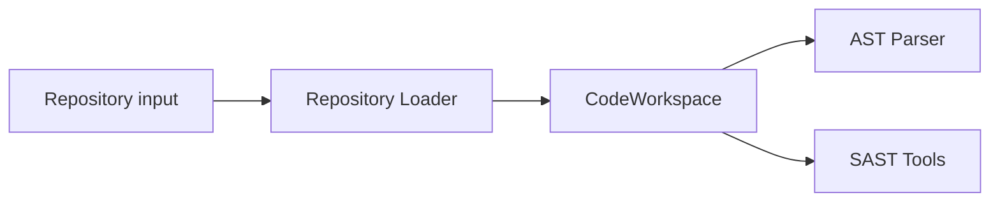

# 저장소 스냅샷 제거와 로컬 작업공간 전환 실행 계획

> **For agentic workers:** REQUIRED SUB-SKILL: Use superpowers:subagent-driven-development (recommended) or superpowers:executing-plans to implement this plan task-by-task. Steps use checkbox (`- [ ]`) syntax for tracking.

**Goal:** Architecture v5와 GitHub 검토 업무에서 저장소 스냅샷 계층을 제거하고 `git clone → commit checkout → CodeWorkspace → AST/SAST` 구조로 일관되게 전환한다.

**Architecture:** `Snapshot Manager`, `RepositorySnapshot`, `snapshot_id`를 제거하고 `Repository Loader`, `CodeWorkspace`, `workspace_id`와 `commit_id`를 사용한다. 공식 프로그램 정책 근거는 삭제하지 않고 `ProgramPolicyRecord`로 이름을 바꾸며, 문서·Mermaid·검토 기준·GitHub Issue를 같은 변경 단위로 맞춘다.

**Tech Stack:** Markdown, Mermaid, Git, GitHub CLI

**Spec:** `docs/superpowers/specs/2026-08-28-remove-repository-snapshot-design.md`

## Global Constraints

- 저장소 코드의 별도 snapshot 생성·복사·장기 보관 기능을 설계에 남기지 않는다.
- 실제 분석은 실행별 로컬 `git clone`과 명시적인 `commit_id` checkout을 사용한다.
- 구현 필드명은 쉬운 영문 `snake_case`, 문서 설명은 짧은 한국어를 함께 사용한다.
- 저장소 코드 의미의 `snapshot`과 공식 정책 기록 의미의 `snapshot`을 모두 활성 문서에서 제거한다.
- `CLONE_FAILED`, `CHECKOUT_FAILED`, `WORKSPACE_MISMATCH`, `WORKSPACE_CHANGED`, `WORKSPACE_MISSING`, `POLICY_FETCH_ERROR`는 취약점 `FALSE`로 바꾸지 않는다.
- `CodeWorkspace`의 로컬 절대 경로는 runtime 내부 값이며 Agent, Finding과 보고서에 노출하지 않는다.
- 스냅샷 전용 GitHub Issue는 없으므로 역할 Issue 전체를 삭제하지 않고 관련 요구만 수정한다.
- H-001은 활성 발견사항에서 제거하고 필요한 최소 안전 조건을 workspace/commit 규칙에 흡수한다.

---

### Task 1: 핵심 흐름과 공통 계약 전환

**Files:**
- Modify: `README.md`
- Modify: `docs/architecture-v5/README.md`
- Modify: `docs/architecture-v5/01-system-overview.md`
- Modify: `docs/architecture-v5/02-static-fact-layer.md`
- Modify: `docs/architecture-v5/08-lightweight-data-contracts.md`

**Interfaces:**
- Consumes: 승인된 `CodeWorkspace`, `RecordMeta`, `CodeLocation`, `CodeSymbol`, `StoredDataRef` 이름과 의미
- Produces: 다른 Architecture 문서와 Issue가 참조할 저장소 입력 흐름과 공통 식별자 기준

- [ ] **Step 1: 기존 스냅샷 기준선 기록**

Run:

```powershell
rg -n -i "RepositorySnapshot|Snapshot Manager|snapshot_id|snapshot root|same snapshot|스냅샷" README.md docs/architecture-v5/README.md docs/architecture-v5/01-system-overview.md docs/architecture-v5/02-static-fact-layer.md docs/architecture-v5/08-lightweight-data-contracts.md
```

Expected: 교체해야 할 저장소 스냅샷 표현이 출력된다.

- [ ] **Step 2: 입력 흐름과 모듈 책임 수정**

`README.md`, v5 README와 `01-system-overview.md`에서 흐름을 다음 순서로 고정한다.

```text
Repository input
→ Repository Loader: git clone and commit checkout
→ CodeWorkspace
→ AST parser and SAST tools in parallel
→ StaticFactBundle
```

`Snapshot Manager` 행과 snapshot 생성 단계를 삭제한다. `Repository Loader`는 clone, checkout, HEAD 확인, 준비 실패 반환만 담당한다고 적는다.

- [ ] **Step 3: 정적 사실 입력과 코드 조회 기준 수정**

`02-static-fact-layer.md`에서 모든 `snapshot_id`를 `workspace_id`로 바꾸고, 코드 위치가 `workspace_root` 기준 상대 경로임을 명시한다. 다른 `workspace_id` 또는 연결된 `commit_id`의 응답은 `WORKSPACE_MISMATCH`로 거절한다.

- [ ] **Step 4: 공통 계약 수정**

`08-lightweight-data-contracts.md`에 다음 타입을 기준 계약으로 작성한다.

```yaml
CodeWorkspace:
  workspace_id: string
  analysis_id: string
  repository_url: string
  commit_id: string
  status: READY | FAILED | REMOVED
  created_at: timestamp

RecordMeta:
  record_id: string
  record_type: string
  schema_version: string
  analysis_id: string
  workspace_id: string
  hypothesis_id: string | null
  attempt_id: string | null
  revision_number: integer
  previous_record_id: string | null
  created_at: timestamp
```

기존 `Scope`와 `snapshot_id` 사용 예시를 제거한다. `CodeLocation`, `CodeSymbol`, `StoredDataRef`도 `workspace_id`를 사용하도록 맞춘다.

- [ ] **Step 5: 핵심 문서 단위 검사**

Run:

```powershell
rg -n -i "RepositorySnapshot|Snapshot Manager|snapshot_id|snapshot root|same snapshot|스냅샷" README.md docs/architecture-v5/README.md docs/architecture-v5/01-system-overview.md docs/architecture-v5/02-static-fact-layer.md docs/architecture-v5/08-lightweight-data-contracts.md
rg -n "Repository Loader|CodeWorkspace|workspace_id|commit_id" README.md docs/architecture-v5/README.md docs/architecture-v5/01-system-overview.md docs/architecture-v5/02-static-fact-layer.md docs/architecture-v5/08-lightweight-data-contracts.md
```

Expected: 첫 명령은 저장소 스냅샷의 현재 구조 설명을 반환하지 않고, 두 번째 명령은 모든 핵심 문서에서 새 구조를 반환한다. 이름 변경표처럼 과거 이름을 설명하는 명시적 마이그레이션 문장은 예외로 검토한다.

- [ ] **Step 6: 핵심 계약 커밋**

```powershell
git add README.md docs/architecture-v5/README.md docs/architecture-v5/01-system-overview.md docs/architecture-v5/02-static-fact-layer.md docs/architecture-v5/08-lightweight-data-contracts.md
git commit -m "docs: replace repository snapshots with code workspaces"
```

---

### Task 2: Agent·검증·체이닝의 workspace 연결 수정

**Files:**
- Modify: `docs/architecture-v5/03-agent-roles-and-orchestration.md`
- Modify: `docs/architecture-v5/04-verification-and-dynamic-reproduction.md`
- Modify: `docs/architecture-v5/06-chaining.md`

**Interfaces:**
- Consumes: Task 1의 `RecordMeta.workspace_id`, `CodeWorkspace.commit_id`, `CodeLocation`
- Produces: 가설, 검증, sandbox와 chain 결과가 같은 로컬 코드 작업공간에 연결되는 규칙

- [ ] **Step 1: Orchestration 입력 검증 수정**

`03-agent-roles-and-orchestration.md`에서 snapshot 고정과 snapshot reference 검사를 제거한다. runtime은 `workspace_id`, 연결된 `commit_id`, 위치 참조와 예산을 검사한다고 적는다.

- [ ] **Step 2: 검증과 동적 재현 수정**

`04-verification-and-dynamic-reproduction.md`에서 Pro/Con, Verification과 Docker가 같은 `workspace_id`와 `commit_id`를 사용한다고 적는다. Docker build와 실행은 분석 작업공간을 직접 수정하지 않는다는 조건을 추가한다.

- [ ] **Step 3: 체이닝 호환 조건 수정**

`06-chaining.md`의 Primitive 예시에서 `snapshot_id`를 `workspace_id`로 바꾼다. chain 후보는 같은 `workspace_id`와 `commit_id`, asset, entity, privilege와 공격 순서가 호환될 때만 생성한다.

- [ ] **Step 4: 문서 단위 검사와 커밋**

Run:

```powershell
rg -n -i "snapshot|스냅샷|RepositorySnapshot|snapshot_id" docs/architecture-v5/03-agent-roles-and-orchestration.md docs/architecture-v5/04-verification-and-dynamic-reproduction.md docs/architecture-v5/06-chaining.md
rg -n "workspace_id|commit_id|WORKSPACE" docs/architecture-v5/03-agent-roles-and-orchestration.md docs/architecture-v5/04-verification-and-dynamic-reproduction.md docs/architecture-v5/06-chaining.md
```

Expected: 첫 명령은 0건이고 두 번째 명령은 세 문서의 새 연결 규칙을 보여 준다.

```powershell
git add docs/architecture-v5/03-agent-roles-and-orchestration.md docs/architecture-v5/04-verification-and-dynamic-reproduction.md docs/architecture-v5/06-chaining.md
git commit -m "docs: bind agent evidence to local workspaces"
```

---

### Task 3: Gate·결과·보안·보고서의 이름과 오류 수정

**Files:**
- Modify: `docs/architecture-v5/05-llm-gate-and-reporting.md`
- Modify: `docs/architecture-v5/07-results-and-observability.md`
- Modify: `docs/architecture-v5/09-llm-provider-session-and-logging.md`
- Modify: `docs/architecture-v5/10-security-boundaries.md`
- Modify: `docs/architecture-v5/11-migration-from-v4.md`
- Modify: `docs/architecture-v5/12-report-draft-template.md`

**Interfaces:**
- Consumes: Task 1의 workspace 계약과 정책 기록 이름
- Produces: `ProgramPolicyRecord`, workspace 오류, 결과 추적과 보고서 표시 기준

- [ ] **Step 1: 정책 기록 이름 전환**

활성 문서 전체에서 다음 이름을 사용한다.

```text
ProgramPolicyRecord
policy_record_id
policy_record_ref
POLICY_FETCH_ERROR
```

공식 정책을 찾을 수 없거나 출처가 불명확하면 기존과 동일하게 `UNCERTAIN + DENY`이며, 오류를 기술 판정 `FALSE`로 바꾸지 않는다.

- [ ] **Step 2: 결과와 오류 목록 수정**

`07-results-and-observability.md`에서 repository/commit/snapshot을 repository/commit/workspace로 바꾸고 다음 오류를 추가한다.

```text
CLONE_FAILED
CHECKOUT_FAILED
WORKSPACE_MISMATCH
WORKSPACE_CHANGED
WORKSPACE_MISSING
POLICY_FETCH_ERROR
```

snapshot 고정 실패 설명은 clone/checkout 실패와 작업공간 변경으로 나눈다.

- [ ] **Step 3: 보안 경계 수정**

`10-security-boundaries.md`에서 snapshot binding과 snapshot root를 제거한다. 실행별 작업공간, `workspace_root` 밖 조회 차단, HEAD/추적 파일 변경 차단, Docker 내부 build 원칙을 사용한다.

- [ ] **Step 4: 마이그레이션과 보고서 수정**

`11-migration-from-v4.md`와 `12-report-draft-template.md`에서 snapshot을 workspace/commit으로 바꾼다. 보고서에는 로컬 절대 경로 대신 repository, commit과 저장소 상대 `CodeLocation`만 표시한다.

- [ ] **Step 5: 문서 단위 검사와 커밋**

Run:

```powershell
rg -n -i "ProgramPolicySnapshot|policy_snapshot|POLICY_SNAPSHOT_ERROR|RepositorySnapshot|snapshot_id|snapshot root|스냅샷" docs/architecture-v5/05-llm-gate-and-reporting.md docs/architecture-v5/07-results-and-observability.md docs/architecture-v5/09-llm-provider-session-and-logging.md docs/architecture-v5/10-security-boundaries.md docs/architecture-v5/11-migration-from-v4.md docs/architecture-v5/12-report-draft-template.md
rg -n "ProgramPolicyRecord|policy_record|POLICY_FETCH_ERROR|CodeWorkspace|workspace_id|commit_id" docs/architecture-v5/05-llm-gate-and-reporting.md docs/architecture-v5/07-results-and-observability.md docs/architecture-v5/09-llm-provider-session-and-logging.md docs/architecture-v5/10-security-boundaries.md docs/architecture-v5/11-migration-from-v4.md docs/architecture-v5/12-report-draft-template.md
```

Expected: 첫 명령은 0건이고 두 번째 명령은 새 이름과 오류가 필요한 문서에 존재한다.

```powershell
git add docs/architecture-v5/05-llm-gate-and-reporting.md docs/architecture-v5/07-results-and-observability.md docs/architecture-v5/09-llm-provider-session-and-logging.md docs/architecture-v5/10-security-boundaries.md docs/architecture-v5/11-migration-from-v4.md docs/architecture-v5/12-report-draft-template.md
git commit -m "docs: update gate results and security for workspaces"
```

---

### Task 4: Mermaid·Wiki·용어 안내 전환

**Files:**
- Modify: `docs/architecture-v5/13-architecture-diagrams.md`
- Modify: `docs/architecture-v5/wiki/diagrams.md`
- Modify: `docs/architecture-v5/wiki/pipeline.md`
- Modify: `docs/architecture-v5/wiki/quick-guide.md`
- Modify: `docs/architecture-v5/wiki/chaining.md`
- Modify: `docs/architecture-v5/wiki/gate-and-reporting.md`
- Modify: `docs/architecture-v5/wiki/results.md`
- Modify: `docs/GLOSSARY.md`
- Modify if needed: `docs/architecture-v5/wiki/agents.md`
- Modify if needed: `docs/architecture-v5/wiki/verification-and-dynamic.md`
- Modify if needed: `docs/architecture-v5/wiki/providers-and-logging.md`
- Modify if needed: `docs/architecture-v5/wiki/README.md`
- Modify if needed: `docs/architecture-v5/wiki/_Sidebar.md`

**Interfaces:**
- Consumes: Task 1–3의 흐름, 계약, 정책 기록과 오류 이름
- Produces: 번호 문서와 의미가 같은 Mermaid 및 쉬운 Wiki 설명

- [ ] **Step 1: Mermaid 입력 흐름 수정**

두 다이어그램 문서에서 `Fix RepositorySnapshot`과 `Fixed RepositorySnapshot` 노드를 삭제한다. 다음 흐름을 사용한다.



Context Retrieval의 조건은 `Same workspace and commit, within budget`으로 바꾸고 정책 노드는 `Official ProgramPolicyRecord`로 바꾼다.

- [ ] **Step 2: Wiki 본문 수정**

pipeline, quick guide, chaining, Gate와 결과 문서에서 snapshot 단계를 제거하고 쉬운 한국어로 clone, commit과 로컬 작업공간을 설명한다. `CodeWorkspace`가 별도의 복사 기능이 아니라 clone된 분석 폴더를 나타낸다는 문장을 처음 등장하는 곳에 추가한다.

- [ ] **Step 3: 용어집 수정**

`docs/GLOSSARY.md`에서 `RepositorySnapshot` 항목을 삭제하고 다음 항목을 추가한다.

| 용어 | 쉬운 설명 | 사용 기준 |
|---|---|---|
| `Repository Loader` | 저장소를 로컬로 가져오고 분석할 commit을 준비하는 프로그램 | 스냅샷을 만들지 않음 |
| `CodeWorkspace` | AST와 SAST가 읽는 실행별 로컬 코드 폴더 | `workspace_id`와 `commit_id`로 구분 |
| `ProgramPolicyRecord` | 공식 버그바운티 정책을 확인해 남긴 기록 | 저장소 코드 복사본이 아님 |

- [ ] **Step 4: Wiki·Mermaid 검사와 커밋**

Run:

```powershell
rg -n -i "RepositorySnapshot|snapshot_id|Fixed RepositorySnapshot|Fix RepositorySnapshot|ProgramPolicySnapshot|policy_snapshot|스냅샷" docs/architecture-v5/13-architecture-diagrams.md docs/architecture-v5/wiki docs/GLOSSARY.md
rg -n "Repository Loader|CodeWorkspace|ProgramPolicyRecord|workspace_id|commit_id" docs/architecture-v5/13-architecture-diagrams.md docs/architecture-v5/wiki docs/GLOSSARY.md
```

Expected: 첫 명령은 0건이며 두 번째 명령은 다이어그램, Wiki와 용어집의 새 구조를 보여 준다.

```powershell
git add docs/architecture-v5/13-architecture-diagrams.md docs/architecture-v5/wiki docs/GLOSSARY.md
git commit -m "docs: redraw architecture without snapshot stage"
```

---

### Task 5: Governance·review·보조 문서 정합성 수정

**Files:**
- Modify: `docs/governance/OPEN_QUESTIONS.md`
- Modify: `docs/governance/REVIEW_CHECKLIST.md`
- Modify: `docs/review/ISSUE_CATALOG.md`
- Modify: `docs/review/FINDINGS.md`
- Modify if needed: `docs/review/ISSUE_TRACKER.md`
- Modify if needed: `docs/DOCUMENT_GUIDE.md`
- Modify if needed: `docs/README.md`
- Modify if needed: `CONTRIBUTING.md`
- Modify: `docs/superpowers/specs/2026-08-27-collaboration-and-readable-docs-design.md`
- Modify: `docs/superpowers/plans/2026-08-27-collaboration-and-readable-docs.md`

**Interfaces:**
- Consumes: Task 1–4에서 확정된 활성 구조
- Produces: 역할 검토 기준, 발견사항과 보조 문서가 현재 설계를 잘못 안내하지 않는 상태

- [ ] **Step 1: 미해결 질문과 체크리스트 수정**

`OPEN_QUESTIONS.md`의 `RepositorySnapshot` identity 질문을 삭제하고, 필요한 경우 clone/checkout 실패와 workspace 변경 처리 확인 항목으로 축소한다. `REVIEW_CHECKLIST.md`의 snapshot 유지 항목을 같은 workspace와 commit 사용 확인으로 바꾼다.

- [ ] **Step 2: 역할별 검토 기준 수정**

`ISSUE_CATALOG.md`의 R2, R3, R4, R6, R7, R8와 종단 시나리오에서 snapshot 요구를 workspace/commit 기준으로 바꾼다. snapshot 생성 또는 별도 원본 사본 보관을 완료 조건으로 남기지 않는다.

- [ ] **Step 3: H-001 제거와 연결 정리**

`FINDINGS.md`에서 H-001 행을 제거한다. 다른 문서의 H-001 연결도 제거하고 H-002 상태·오류 계약 작업은 유지한다. Git 이력으로 삭제 이전 기록을 확인할 수 있으므로 활성 발견사항에는 스냅샷 요구를 남기지 않는다.

- [ ] **Step 4: 보조 명세·계획의 현재 기준 설명 수정**

이전 협업 명세와 계획에서 `snapshot`을 현재 공통 용어로 가르치는 항목을 `CodeWorkspace`로 바꾼다. 과거 작업의 목적과 완료 기록은 바꾸지 않는다.

- [ ] **Step 5: 보조 문서 검사와 커밋**

Run:

```powershell
rg -n -i "RepositorySnapshot|snapshot_id|Snapshot Manager|ProgramPolicySnapshot|policy_snapshot|스냅샷" docs/governance docs/review docs/DOCUMENT_GUIDE.md docs/README.md CONTRIBUTING.md docs/superpowers/specs/2026-08-27-collaboration-and-readable-docs-design.md docs/superpowers/plans/2026-08-27-collaboration-and-readable-docs.md
rg -n "H-001" docs --glob '!docs/superpowers/specs/2026-08-28-remove-repository-snapshot-design.md' --glob '!docs/superpowers/plans/2026-08-28-remove-repository-snapshot.md'
```

Expected: 첫 명령은 현재 구조로 오해할 표현 0건, 두 번째 명령은 0건이다. `PROVENANCE.md`처럼 외부에서 가져온 문서 상태를 설명하는 일반 단어는 저장소 분석 구조인지 사람이 확인한다.

```powershell
git add CONTRIBUTING.md docs/README.md docs/DOCUMENT_GUIDE.md docs/governance docs/review docs/superpowers/specs/2026-08-27-collaboration-and-readable-docs-design.md docs/superpowers/plans/2026-08-27-collaboration-and-readable-docs.md
git commit -m "docs: align governance with local workspace model"
```

---

### Task 6: GitHub Issue 본문 전환

**Files:**
- Remote modify: GitHub Issue #2, #3, #4, #5, #6, #7, #8, #9, #10, #13, #14, #15, #16 when matching text exists

**Interfaces:**
- Consumes: 병합 후보 commit의 문서 이름과 완료 조건
- Produces: 역할별 업무 지시가 현재 Architecture v5와 같은 이름과 흐름을 사용함

- [ ] **Step 1: Issue 기준선 다시 가져오기**

Run:

```powershell
gh issue list --repo SASTsimi/sastsimi --state open --limit 100 --json number,title,body,url
```

Expected: open Issue 본문 전체를 확인할 수 있다.

- [ ] **Step 2: snapshot 표현이 있는 Issue만 수정**

각 Issue의 기존 담당자, 쉬운 설명, 다른 업무와 체크박스는 유지하고 다음 의미만 바꾼다.

```text
RepositorySnapshot → CodeWorkspace
snapshot_id → workspace_id
same snapshot → same workspace_id and commit_id
snapshot mismatch → WORKSPACE_MISMATCH
ProgramPolicySnapshot → ProgramPolicyRecord
policy snapshot fetch failure → POLICY_FETCH_ERROR
```

Issue별 필수 수정:

- #3: `git clone → commit checkout → CodeWorkspace → AST/SAST`, 상대 코드 위치와 workspace 밖 조회 차단
- #4: 모듈 지도와 통합 테스트의 workspace/commit 연결
- #13: 공통 식별자를 `analysis_id`, `workspace_id`, `commit_id` 기준으로 수정하고 H-001·snapshot 계약 삭제
- #14: 늦게 온 다른 workspace/commit 결과 거절 시나리오
- #15: runtime의 workspace/commit 일치와 작업공간 밖 접근 차단
- #16: 완료 조건과 연결 발견사항에서 H-001 제거
- 나머지 Issue: 검색에서 발견된 snapshot 또는 정책 snapshot 표현만 같은 규칙으로 수정

- [ ] **Step 3: 원격 Issue 검증**

Run:

```powershell
gh issue list --repo SASTsimi/sastsimi --state open --limit 100 --json number,title,body,url
```

Expected: open Issue에 `RepositorySnapshot`, `snapshot_id`, `ProgramPolicySnapshot`, `policy_snapshot`이 0건이고 #3, #13, #14, #15에 `CodeWorkspace`, `workspace_id` 또는 `commit_id`가 존재한다.

- [ ] **Step 4: 역할과 기존 업무 보존 확인**

#2의 TRUE+TRUE 체이닝, #3–#9 담당자, #13–#16 담당자와 각 Issue의 기존 비-snapshot 완료 조건이 유지되었는지 수정 전 본문과 비교한다.

---

### Task 7: 전체 교차 검증, PR과 merge

**Files:**
- Verify: repository-wide Markdown and Mermaid files
- Remote create/update: Pull request from `docs/remove-repository-snapshot` to `main`

**Interfaces:**
- Consumes: Task 1–6 전체 변경
- Produces: merge 가능한 문서 변경과 검증 증거

- [ ] **Step 1: 저장소 전체 금지 이름 검색**

Run:

```powershell
rg -n -i "RepositorySnapshot|snapshot_id|Snapshot Manager|ProgramPolicySnapshot|policy_snapshot_id|policy_snapshot_ref|POLICY_SNAPSHOT_ERROR" . --glob '!**/.git/**'
```

Expected: 승인 명세와 실행 계획의 이름 변경표 이외 0건이다. 명세와 계획의 과거 이름은 제거 대상을 설명하므로 허용한다.

- [ ] **Step 2: 새 이름과 필수 오류 검색**

Run:

```powershell
rg -n "Repository Loader|CodeWorkspace|workspace_id|commit_id|ProgramPolicyRecord|POLICY_FETCH_ERROR|WORKSPACE_CHANGED" README.md docs
```

Expected: 핵심 계약, 번호 문서, Wiki, review와 governance에서 새 이름이 확인된다.

- [ ] **Step 3: 형식 검사**

Run:

```powershell
git diff origin/main --check
```

Expected: 출력 없이 exit code 0.

모든 Markdown fence가 짝을 이루는지, 로컬 Markdown 링크 대상이 존재하는지, Mermaid block이 파싱되는지 검사한다. 검사기가 저장소에 없으면 읽기 전용 PowerShell 검사를 사용하고 결과를 PR 본문에 기록한다.

- [ ] **Step 4: 의미 교차 검토**

다음 시나리오를 문서만 보고 처음부터 끝까지 추적한다.

1. clone 실패가 `FALSE`가 되지 않고 분석 실행 오류로 끝난다.
2. checkout 실패가 AST/SAST 실행으로 넘어가지 않는다.
3. AST와 SAST가 같은 `workspace_id`와 `commit_id`를 사용한다.
4. 분석 도중 코드 변경이 `WORKSPACE_CHANGED`로 차단된다.
5. Docker 동적 재현이 분석 작업공간을 직접 수정하지 않는다.
6. 공식 정책 조회 실패가 `UNCERTAIN + DENY`와 `POLICY_FETCH_ERROR`로 남는다.
7. 보고서에 로컬 절대 경로가 노출되지 않는다.

- [ ] **Step 5: 최종 상태 확인과 push**

Run:

```powershell
git status --short
git log --oneline origin/main..HEAD
git push origin docs/remove-repository-snapshot
```

Expected: 계획된 문서만 변경되고 모든 커밋이 원격 브랜치에 존재한다.

- [ ] **Step 6: PR 생성과 검토**

PR 제목은 `docs: replace repository snapshots with local code workspaces`로 한다. 본문에는 목적, 주요 이름 변경, Issue 수정 목록, 검색·형식·시나리오 검증 결과와 `Refs #3`, `Refs #5`, `Refs #13`, `Refs #14`, `Refs #15`를 기록한다.

PR diff, base/head, merge 가능 상태와 GitHub checks를 다시 확인한다. Blocker 또는 High 문제가 있으면 merge하지 않고 수정 후 모든 검사를 반복한다.

- [ ] **Step 7: merge와 사후 확인**

PR을 squash merge하고 원격 `main`에서 새 문서가 보이는지 확인한다. Issue 본문과 `main`의 용어가 다시 일치하는지 검색한다. 설계 전체 승인이나 runtime 구현 완료로 표시하지 않는다.
