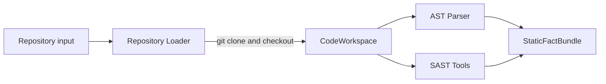

# 저장소 스냅샷 제거와 로컬 분석 작업공간 전환 설계

## 문서 상태

- 결정 상태: 승인됨
- 적용 대상: Architecture v5 설계 초안, Wiki, Mermaid, governance/review 문서, GitHub Issue
- 구현 상태: 문서와 Issue 수정 전
- 결정일: 2026-08-28

## 1. 결정 요약

SASTSIMI는 별도의 저장소 스냅샷을 만들거나 보관하지 않는다. 사용자가 입력한 Git 저장소를 실행별 로컬 폴더에 `git clone`하고, 분석할 `commit_id`를 checkout한 뒤 AST parser와 SAST 도구가 그 폴더를 함께 읽는다.

기존 `Snapshot Manager`, `RepositorySnapshot`, `snapshot_id`와 저장소 스냅샷 불변성 계약은 제거한다. 이를 `Repository Loader`, `CodeWorkspace`, `workspace_id`와 `commit_id`로 대체한다.

이 결정은 저장소 코드에 대한 스냅샷 기능을 제거하는 것이다. 공식 버그바운티 정책 근거는 여전히 필요하므로 삭제하지 않고 `ProgramPolicySnapshot`을 `ProgramPolicyRecord`로 이름을 바꾼다.

## 2. 선택 이유

현재 파이프라인은 분석할 저장소를 로컬에 clone한 뒤 AST와 SAST를 실행한다. 동일한 코드를 별도의 스냅샷 객체나 복사본으로 다시 만드는 기능은 초기 설계에 불필요한 저장·무결성·복구 복잡도를 추가한다.

로컬 clone을 분석 실행 전용 폴더로 사용하고 정확한 `commit_id`를 기록하면 다음 목적을 더 단순하게 달성할 수 있다.

- AST와 SAST가 같은 코드를 읽는다.
- 분석 결과가 어느 commit에서 만들어졌는지 확인할 수 있다.
- 분석 실행 사이의 로컬 파일이 섞이지 않는다.
- 별도의 스냅샷 생성·보관·해시 계산 모듈이 필요하지 않다.

## 3. 적용 범위와 비범위

### 적용 범위

- 저장소 입력과 clone/checkout 흐름
- 공통 식별자와 코드 위치 참조
- AST/SAST 및 코드 문맥 조회 입력
- 검증, 동적 재현, 체이닝, Gate, 보고서의 코드 버전 연결
- 결과 저장, 오류, 추적 정보와 부정 테스트
- Architecture v5 문서, Wiki, Mermaid, 용어집과 검토 문서
- GitHub 역할별 상위 Issue와 R4 하위 Issue

### 비범위

- Git 서버나 저장소 호스팅 제품 선택
- clone cache 구현
- 로컬 작업공간 보존 기간 구현
- Git 인증 방식 구현
- 정적분석 도구나 Agent의 취약점 판단 방식 변경
- 공식 프로그램 정책 근거 제거

## 4. 새 저장소 입력 흐름



### Repository Loader

`Repository Loader`는 다음 작업만 담당한다.

1. 실행별 새 로컬 폴더를 만든다.
2. 입력 저장소를 `git clone`한다.
3. 분석할 `commit_id`를 checkout한다.
4. checkout이 끝난 HEAD가 요청한 `commit_id`와 같은지 확인한다.
5. 준비된 작업공간을 `READY`로 표시한다.
6. clone 또는 checkout 실패를 실행 오류로 반환한다.

`Repository Loader`는 저장소 스냅샷을 생성하거나 별도 원본 사본을 장기 보관하지 않는다.

### CodeWorkspace

```yaml
CodeWorkspace:
  workspace_id: string
  analysis_id: string
  repository_url: string
  commit_id: string
  status: READY | FAILED | REMOVED
  created_at: timestamp
```

- `workspace_id`: 분석에 사용하는 로컬 작업공간 번호
- `analysis_id`: 전체 분석 실행 번호
- `repository_url`: clone한 원격 저장소 주소
- `commit_id`: 분석 대상 Git commit 번호
- `status`: 사용할 수 있음, 준비 실패 또는 정리됨 상태
- `created_at`: 작업공간이 생성된 UTC 시각

실제 로컬 경로는 runtime 내부 값으로만 관리한다. Agent 입력, 보고서와 외부 결과에는 로컬 절대 경로를 전달하지 않는다.

## 5. 공통 식별자 변경

```yaml
RecordMeta:
  record_id: string
  record_type: string
  schema_version: string
  analysis_id: string
  workspace_id: string
  hypothesis_id: string | null
  attempt_id: string | null
  revision_number: integer
  previous_record_id: string | null
  created_at: timestamp
```

모든 주요 저장 결과는 `meta: RecordMeta`를 사용한다. `analysis_id`와 `workspace_id`는 항상 필요하다. 가설별 결과는 `hypothesis_id`, 재시도 가능한 실행 결과는 `attempt_id`가 반드시 필요하다.

결과를 수정할 때 기존 결과를 덮어쓰지 않는다. 새 `record_id`와 증가한 `revision_number`를 만들고 `previous_record_id`로 이전 결과를 연결한다.

### 이름 변경표

| 제거할 이름 | 새 이름 | 쉬운 의미 |
|---|---|---|
| `Snapshot Manager` | `Repository Loader` | 저장소를 clone하고 commit을 준비하는 모듈 |
| `RepositorySnapshot` | `CodeWorkspace` | 실제 분석에 사용하는 로컬 코드 폴더 |
| `snapshot_id` | `workspace_id` | 로컬 분석 작업공간 번호 |
| `snapshot root` | `workspace_root` | 로컬 분석 폴더의 기준 경로 |
| `same snapshot` | 같은 `workspace_id`와 `commit_id` | 같은 로컬 폴더와 같은 Git commit |
| `SNAPSHOT_MISMATCH` | `WORKSPACE_MISMATCH` | 다른 분석 작업공간 결과가 섞임 |
| `ProgramPolicySnapshot` | `ProgramPolicyRecord` | 공식 프로그램 정책을 확인한 기록 |
| `policy_snapshot_id` | `policy_record_id` | 공식 정책 기록 번호 |
| `policy_snapshot_ref` | `policy_record_ref` | 공식 정책 기록 참조 |
| `POLICY_SNAPSHOT_ERROR` | `POLICY_FETCH_ERROR` | 공식 정책을 가져오지 못함 |

## 6. 코드 위치와 저장 결과 참조

```yaml
CodeLocation:
  workspace_id: string
  file_path: string
  start_line: integer
  start_column: integer
  end_line: integer
  end_column: integer
```

- `file_path`는 `workspace_root` 기준 상대 경로다.
- 줄과 열은 1부터 시작한다.
- `..` 경로 이동, 작업공간 밖 symlink 접근과 절대 경로 입력을 거절한다.
- 같은 근거 묶음에서 서로 다른 `workspace_id` 또는 `commit_id`를 섞지 않는다.

```yaml
CodeSymbol:
  symbol_id: string
  symbol_kind: FILE | CLASS | FUNCTION | METHOD | VARIABLE | ROUTE
  name: string
  location: CodeLocation
```

`symbol_id`는 같은 `workspace_id` 안에서 유일하다.

```yaml
StoredDataRef:
  stored_data_id: string
  data_kind: string
  content_hash: string
  workspace_id: string
```

내부 저장 경로나 URI를 파트 사이 계약으로 전달하지 않는다. 소비자는 `stored_data_id`로 결과를 요청하고 `content_hash`로 내용 변경 여부를 확인한다.

## 7. 작업공간 변경 방지

스냅샷 기능은 제거하지만 분석 도중 코드가 바뀐 상태로 결과를 합치지는 않는다.

- 실행별로 별도 작업공간을 사용한다.
- checkout 후 분석 작업공간은 읽기 전용으로 취급한다.
- AST/SAST와 코드 조회는 같은 `workspace_id`를 사용한다.
- runtime이 HEAD 변경이나 추적 파일 변경을 발견하면 `WORKSPACE_CHANGED`를 기록하고 해당 실행 결과를 사용하지 않는다.
- 동적 재현의 build와 실행은 분석 작업공간을 직접 수정하지 않고 Docker sandbox 안에서 수행한다.
- 작업공간이 삭제된 뒤 추가 코드 조회 요청이 오면 `WORKSPACE_MISSING`으로 처리한다.

이 검사는 별도 스냅샷을 만들기 위한 검사가 아니라 이미 준비된 로컬 분석 폴더가 실행 중 바뀌지 않았는지 확인하는 최소 안전 조건이다.

## 8. clone과 의존 파일 처리

- submodule이 분석 범위에 필요하면 `Repository Loader`가 명시적으로 초기화한다.
- submodule 초기화에 실패하면 실패 범위를 `gaps`에 기록한다.
- Git LFS 파일이 pointer 상태로 남으면 해당 파일을 실제 코드로 간주하지 않고 `gaps`에 기록한다.
- 생성 파일과 설치 과정에서 만들어진 의존 파일은 원본 저장소 코드로 취급하지 않는다. 생성 도구와 입력, 생성 시각을 별도 결과로 기록한다.
- submodule, LFS 또는 생성 파일 부족은 자동으로 취약점 `FALSE`가 되지 않는다.

## 9. 오류 변경

### 제거하는 오류

- `SNAPSHOT_CREATE_ERROR`
- `SNAPSHOT_MISMATCH`
- `POLICY_SNAPSHOT_ERROR`

### 사용하는 오류

| 오류 | 의미 |
|---|---|
| `CLONE_FAILED` | 저장소 clone 실패 |
| `CHECKOUT_FAILED` | 요청한 commit checkout 실패 |
| `WORKSPACE_MISMATCH` | 결과가 현재 분석 작업공간과 다름 |
| `WORKSPACE_CHANGED` | 분석 도중 HEAD 또는 추적 파일이 바뀜 |
| `WORKSPACE_MISSING` | 필요한 로컬 작업공간이 이미 없음 |
| `POLICY_FETCH_ERROR` | 공식 프로그램 정책을 가져오지 못함 |

위 오류는 취약점 판정 `FALSE`로 변환하지 않는다. 해당 단계는 실패 또는 보완 필요 상태로 남기고, 사용할 수 없는 근거는 판정에서 제외한다.

## 10. 문서와 Issue 변경 범위

### Architecture v5와 공통 문서

다음 범주의 모든 저장소 스냅샷 표현을 삭제하거나 새 구조로 교체한다.

- root `README.md`
- `docs/architecture-v5/README.md`
- Architecture v5 `01`–`13`
- `docs/architecture-v5/wiki/`
- Mermaid 다이어그램
- `docs/GLOSSARY.md`
- `docs/governance/`
- `docs/review/`
- 관련 설계 명세와 계획 문서에서 현재 기준을 설명하는 부분

과거 결정 기록은 Git 이력에 남으므로 현재 기준 문서에서 더 이상 `RepositorySnapshot`을 활성 구조로 설명하지 않는다.

### GitHub Issue

- #3: 저장소 버전 고정과 snapshot 요구를 `git clone`, `CodeWorkspace`, `commit_id` 기준으로 바꾼다.
- #13: `snapshot_id`, `RepositorySnapshot`과 snapshot 불변성 항목을 제거하고 `workspace_id`, `commit_id`와 작업공간 오류 기준으로 바꾼다.
- #14: 다른 snapshot 결과 시나리오를 다른 workspace 또는 commit 결과 시나리오로 바꾼다.
- #15: runtime의 snapshot binding을 workspace와 commit 일치 검사로 바꾼다.
- #4와 다른 역할 Issue에 남은 snapshot 표현도 같은 기준으로 바꾼다.
- 스냅샷만을 위한 독립 Issue는 현재 없으므로 Issue 전체를 삭제하지 않는다.

### 발견사항

현재 `H-001`의 `RepositorySnapshot` 불변성 요구는 활성 발견사항에서 제거한다. 필요한 안전 조건은 `CodeWorkspace`의 commit 확인과 실행 중 변경 금지 규칙으로 흡수한다.

## 11. 검증 기준

문서 변경 후 다음을 검사한다.

1. 저장소 코드 의미의 `RepositorySnapshot`, `snapshot_id`, `Snapshot Manager`가 활성 문서에 0건이다.
2. `ProgramPolicySnapshot`과 `policy_snapshot_*`가 활성 문서에 0건이다.
3. 모든 코드 위치와 정적 근거가 `workspace_id`를 사용한다.
4. 저장소 입력 흐름이 `git clone → commit checkout → CodeWorkspace → AST/SAST` 순서다.
5. Mermaid에 Snapshot 단계나 노드가 없다.
6. #3, #4, #13, #14, #15와 관련 Issue의 이름과 완료 조건이 새 구조와 일치한다.
7. `CLONE_FAILED`, `CHECKOUT_FAILED`, `WORKSPACE_CHANGED`가 `FALSE`로 변환되지 않는다고 명시한다.
8. 공식 정책 기록은 삭제되지 않고 `ProgramPolicyRecord`로 일관되게 사용된다.
9. Markdown link, code fence와 Mermaid 문법 검사를 통과한다.

## 12. 완료 상태의 의미

이 변경이 끝나면 Architecture v5 설계 초안과 GitHub 검토 업무가 스냅샷 없는 로컬 clone 분석 모델을 일관되게 설명한다. 이는 runtime 코드 구현이나 Architecture v5 전체 최종 승인을 뜻하지 않는다.
